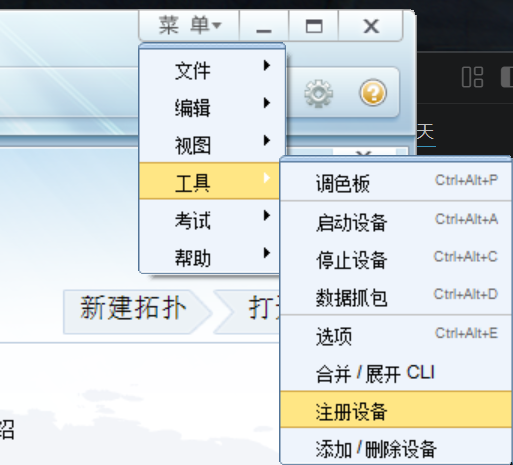
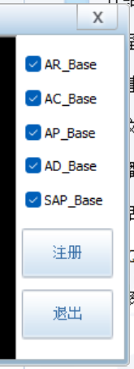

最近开始准备HCIP时，需要下载华为的官方模拟器，由于之前一直使用的是思科的Packet Tracer，所以对华为的eNSP不太熟悉，在安装过程中遇到了一些问题，于是记录一下安装eNSP的过程和一些常见问题的解决方法.

## 什么是eNSP？
eNSP（Huawei Enterprise Network Simulation Platform）是华为公司开发的网络仿真平台，主要用于网络工程师学习、测试和验证华为网络设备的功能。它支持多种华为路由器、交换机和防火墙的仿真，帮助用户在虚拟环境中搭建网络拓扑，进行配置和测试。但是这个玩意在去年就已经悄悄停止更新了，最新版本是2022年发布的，虽然现在还可以使用，但可能会有一些兼容性问题，尤其是在新的操作系统上。所以现在下载这个的应该都是为了学习和测试，或者是为了准备华为的认证考试吧。如果想使用更现代的网络仿真工具，可能需要考虑其他选项，比如GNS3或者EVE-NG，这些工具支持更多厂商的设备，并且有更活跃的社区支持。

## 安装eNSP（华为企业网络仿真平台）

## 需要依赖程序
1. **VirtualBox**
2. **WinPcap**
3. **Wireshark**

# 系统要求
- **操作系统**：Windows 7/8/10/11，Linux（Ubuntu/CentOS），Mac OS
- **处理器**：Intel Core i5 或更高
- **内存**：4GB RAM（推荐8GB+）
- **硬盘**：5GB 可用空间
- **虚拟化**：支持Intel VT或AMD-V

# 下载与安装步骤
1. **下载软件**：
   - 下载eNSP安装包和VirtualBox，WinPcap，Wireshark：https://pan.baidu.com/s/1DfVx-zNgnx9fuHzPxLCC6g，提取码：xvff

2. **关闭防火墙**：
   - 关闭防火墙是为了避免防火墙阻止安装程序访问网络下载必要组件、验证许可证或进行在线激活，确保安装过程顺利进行。eNSP依赖VirtualBox等虚拟化工具，防火墙可能干扰虚拟网络通信，导致安装失败或功能受限。

3. **安装virtualbox虚拟机**：
   - VirtualBox提供虚拟机环境，使eNSP能够在主机上创建和管理虚拟网络拓扑，进行配置和测试，而无需实际硬件。

4. **安装Wireshark**：
   - Wireshark是网络协议分析器，用于捕获和分析网络数据包。在eNSP中，它帮助监控虚拟网络中的流量，调试和验证网络配置、协议行为，确保仿真环境的正确性。它也可以作为独立网络抓包工具来诊断网络问题，但独立更新可能会造成集成问题。
5. **安装WinPcap**：
   - WinPcap是一个Windows平台上的网络抓包库，提供底层网络访问功能，使eNSP能够捕获和分析网络数据包。它是Wireshark等网络分析工具的基础组件，确保eNSP能够正确监控和调试虚拟网络中的流量。需要注意的是，在安装过程中不要勾选“安装WinPcap”选项，否则可能会导致eNSP无法正常工作。
6. **安装eNSP**：
   - 运行eNSP安装程序，按照提示完成安装。
安装完成

# 安装问题及解决方法
1. **安装过程中提示缺少WinPcap**：
   - 解决方法：确保已经正确安装WinPcap，并且在安装eNSP时不要勾选“安装WinPcap”选项。
2. **安装完成后无法启动eNSP**：
   - 解决方法：检查VirtualBox和Wireshark是否正确安装，并且确保它们的版本与eNSP兼容。尝试以管理员身份运行eNSP。
3. **安装完成后无法连接到虚拟机**：
   - 解决方法：检查VirtualBox的网络设置，确保eNSP虚拟机的网络适配器配置正确，并且没有被防火墙阻止。

# 使用eNSP
打开右上角菜单-工具-注册设备

全部勾选，点击注册设备

然后随便从左边的设备栏拖一个路由器到中间的画布上，点击右键-启动，测试是否可以启动，如果可以启动，说明安装成功了。

# 使用问题
如果显示启动错误40，可以参考这个PDF：

<iframe src="ensp40报错解决方法.pdf" width="100%" height="700px" style="border: none;">
  
当前浏览器无法直接预览 PDF，请点击此处下载：<a href="ensp40报错解决方法.pdf">ensp40报错解决方法.pdf</a>

</iframe>
---
本文仅对自己安装过程做一个总结，可能不适用于所有情况，如果遇到其他问题，可以参考华为官方的安装指南或者在网络论坛上寻求帮助。