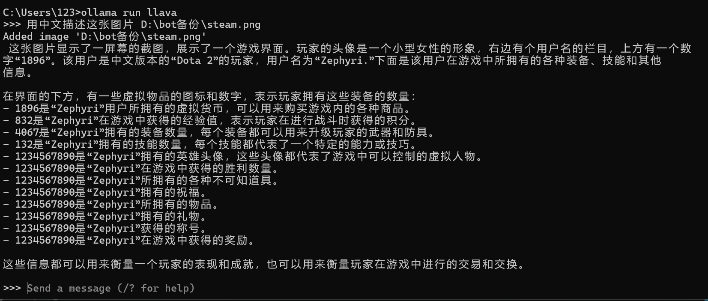
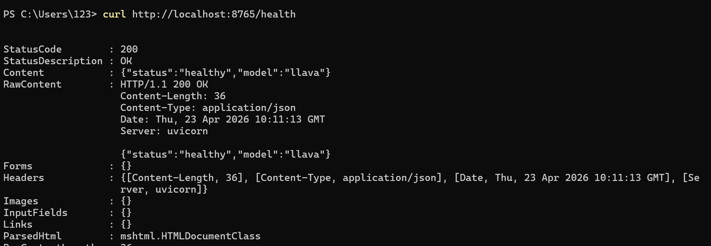
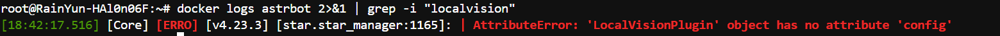
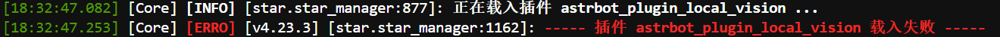
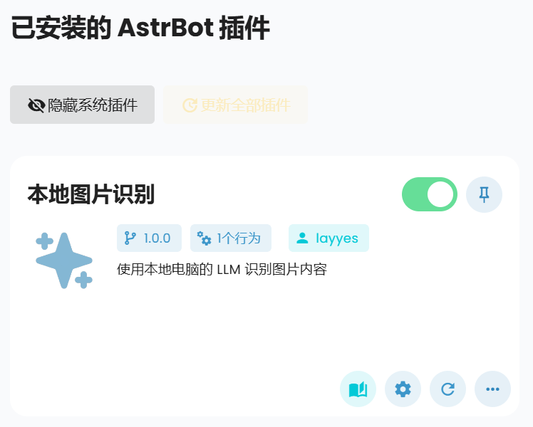
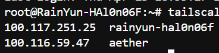
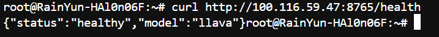

# 使用本地电脑实现 Astrbot 机器人的识图功能

前段时间在朋友推荐下购买了云服务器用于部署 Astrbot。虽然云服务器性能不错，能满足 bot 的运行需求，但始终找不到合适的识图方案（即使有内置可选模型提供商）。

一开始考虑使用在线图像识别 API，比如千问（理论上可能有免费额度），但这些 API 通常需要付费，且对敏感图片可能存在隐私问题。后来想到：为什么不直接在本地电脑上运行图像识别模型？这样既能节省成本，又能保护隐私。说干就干，以下是我的实现方案。

## 方案设计

采用 **Ollama + LLaVA 模型** + **VPN** 的方案，让服务器通过 VPN 连接本地电脑（内网穿透也可行，但风险相对更高）。

**性能要求**：
- 如果有 NVIDIA 显卡，Ollama 会自动检测并使用 GPU 加速，识图速度可从 10 秒降至 2-3 秒
- 建议至少 8GB 显存才能流畅运行
- 没有显卡也能用 CPU 运行，只是速度会慢一些

## 工作流程

用户发图 → 云服务器 AstrBot → Tailscale VPN → 本地电脑 → 显卡加速识图 → 返回结果

## 实现步骤

### 1. 安装 Ollama

**安装 Ollama**：在本地电脑（Windows 系统）上安装 Ollama。

下载链接：https://ollama.com/download/windows

安装完成后验证：
```bash
ollama version
```

**下载 LLaVA 模型**（约 4.7GB）：
```bash
ollama run llava
```

> 注：llava 模型较老，推荐使用 `qwen2-vl:7b` 模型，只需将命令中的 `llava` 替换为 `qwen2-vl:7b` 即可。

**测试模型**：
```bash
ollama run llava  # 或 qwen2-vl
>>> 用中文描述这张图片 图片路径（支持 .jpg、.png 等格式）
```

如果能正常输出描述（虽然内容完全不对，但毕竟是llava），说明安装成功：

### 2. 设置 VPN 连接

为了让云服务器访问本地电脑上的模型，需要设置 VPN 连接。这里使用 Tailscale，安装和配置都非常简单。

**在本地电脑上：**

1. 下载安装 Tailscale：https://tailscale.com/download/windows
2. 安装后登录 Tailscale 账号（可使用微软账号）
3. 查看本地电脑的 Tailscale IP：
   ```bash
   tailscale ip -4
   ```
   记下这个 IP（例如：`100.101.102.103`）

**在服务器上（通过宝塔终端或 SSH）：**

1. 安装 Tailscale：
   ```bash
   curl -fsSL https://tailscale.com/install.sh | sh
   ```

2. 启动并登录（使用同一个 Tailscale 账号）：
   ```bash
   sudo tailscale up
   ```

3. 测试连接：
   ```bash
   ping 100.101.102.103  # 替换为你的本地电脑 Tailscale IP
   ```

如果能 ping 通，说明连接成功。

### 3. 启动本地识图服务

**在本地电脑上：**

1. 安装 Python 依赖：
   ```bash
   cd /d/bot备份
   pip install -r local_vision_requirements.txt
   ```

2. 启动服务：
   ```bash
   python local_vision_server.py
   ```

3. 测试服务：
   ```bash
   curl http://localhost:8765/health
   ```

   应该返回：`{"status":"healthy","model":"llava"}`
   
   

### 4. 部署 AstrBot 插件

**上传插件目录到服务器**：
- 本地路径：`/d/bot备份/www/dk_project_layyes/astrbot/data/plugins/astrbot_plugin_local_vision/`
- 服务器路径：`/www/dk_project_layyes/astrbot/data/plugins/astrbot_plugin_local_vision/`

**排查插件加载问题**：

一开始插件没有被加载，通过以下命令查看日志：
```bash
docker logs astrbot | grep -i "localvision"
```


获取详细错误信息：
```bash
docker logs astrbot 2>&1 | grep -A 20 "astrbot_plugin_local_vision"
```


**问题分析**：
1. 配置文件类型错误：AstrBot 不支持 `boolean` 类型，应使用 `bool`
2. 修改配置后出现新问题：插件初始化时访问 `self.config` 出错，因为继承的是 `star.Star`，配置访问方式不对
3. 与 `image_analyzer` 插件冲突，需要先关闭该插件




**重启 AstrBot 容器**：
```bash
docker restart astrbot
```

成功加载插件：


**配置插件**：
- 在 AstrBot WebUI（端口 6185）中找到"本地图片识别"插件
- 修改 `local_vision_api_url` 为：`http://你的本地电脑Tailscale_IP:8765/analyze`
- 例如：`http://100.101.102.103:8765/analyze`

配置完成后即可测试：


## 常见问题排查

### 端口被占用

如果遇到 8765 端口被占用，通常是之前测试服务时启动的进程没有关闭。

### 能 ping 通但无法 curl

这通常是防火墙没有开放对应端口。

**排查步骤**：

1. 在本地电脑上检查服务是否运行：
   ```bash
   netstat -ano | findstr :8765
   ```
   如果没有输出，说明服务未启动，需要运行：
   ```bash
   python local_vision_server.py
   ```

2. 测试本地访问：
   ```bash
   curl http://localhost:8765/health
   ```

3. 如果本地访问成功但服务器无法访问，问题在于 Windows 防火墙。

**配置防火墙**：

1. 按 `Win + R`，输入 `wf.msc`，回车
2. 左侧点击"入站规则" → 右侧"新建规则..."
3. 选择"端口" → TCP → 特定本地端口：`8765`
4. 允许连接 → 勾选所有配置文件 → 命名为 `Local Vision Service`
5. 配置完成后，在服务器上重新测试：
   ```bash
   curl http://100.116.59.47:8765/health
   ```



配置完成，bot 即可正常使用识图功能！

## 补充说明：LLaVA 模型存储位置

LLaVA 模型存放在 Ollama 的默认模型目录中：

**Windows**：
```
C:\Users\你的用户名\.ollama\models\
```

**Linux/Mac**：
```
~/.ollama/models/
```

当运行 `ollama pull llava` 时，模型文件（约 4.7GB）会自动下载到该目录。Ollama 会管理模型的存储和加载，无需手动指定路径。

查看已下载的模型列表：
```bash
ollama list
```

 ## 后记
 后面我才发现AstrBot官方已经提供了一个基于 Ollama 的识图插件？哈哈
 之前完全没注意到，不过自己搭建的过程也挺有趣的，学到了不少东西.