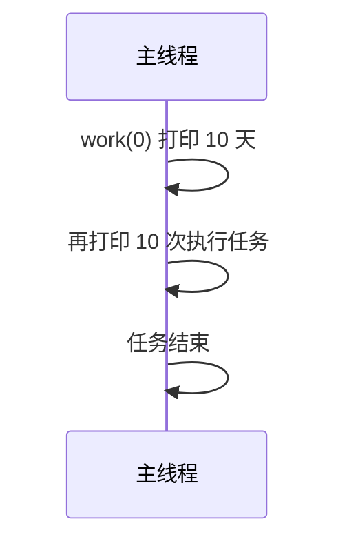
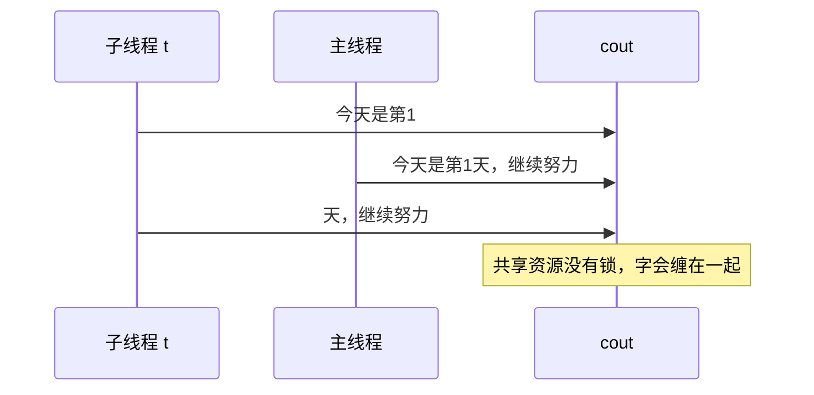

有时候遇到多个任务执行速度会感觉比较慢，比如：
<!-- more -->
```cpp
#include <iostream>

void time(int ms) { //这行代码是模仿进行任务时消耗的时间
std::this_thread::sleep_for(std::chrono::milliseconds(ms));
}

void work(int i) {
	for (; i < 10; ++i) {
		std::cout << "今天是第" << i << "天，继续努力\n";
		time(1000);
	}
}

int main() {
	work(0);

	for (int i = 0; i < 10; ++i) {
		std::cout << "执行任务\n";
		time(1000);
	}
	std::cout << "任务结束";
}
```
运行结果是串行的：`work` 先把 10 天打完，主线程的“执行任务”才开始。



这么看第一个任务执行完才执行第二个任务是否有点太慢了？所以需要多线程让两个任务同时进行
需要以下预处理头文件：`#include <thread>`
然后代码如下：
```cpp
#include <iostream>
#include <thread> //导入的线程头文件

void time(int ms) {
std::this_thread::sleep_for(std::chrono::milliseconds(ms));
}

void work(int i) {
	for (; i < 10; ++i) {
		std::cout << "今天是第" << i << "天，继续努力\n";
		time(1000);
	}
}

int main() {
	std::thread t(work, 0);

	work(0);

	for (int i = 0; i < 10; ++i) {
		std::cout << "执行任务\n";
		time(1000);
	}
	std::cout << "任务结束";

	t.join();//此为回收线程
}
```
运行如下，两条线叠在一起写 `cout`，输出会交叉：



可以看到现在是可以进行多任务了，但是似乎运行结果有点问题，经过搜索发现这是因为在多线程编程中，控制台屏幕（也就是 `std::cout`）是一个**共享资源** 。 当多个线程同时向 `std::cout` 写入数据时，如果没有任何同步机制，它们的输出就会交织在一起，就像多个人同时拿着同一个话筒说话一样，导致最终的字句重叠、错乱。这种现象被称为数据竞争（Data Race）或输出混乱。当子线程刚打印完 `"今天是第1"`，还没来得及打印后面的内容和换行符 `\n` 时，主线程突然抢到了 CPU 的执行权，也往控制台打印了 `"今天是第1天，继续努力\n"`。这就导致两个线程的输出**混杂在了一起**。
至于如何避免，那就需要[互斥锁](/knowledge-base/knowledge/C和C++/互斥锁.md)了，现在先看看其他方法。
## 其他方法

```cpp
#include <iostream>
#include <thread>


void time(int ms) {
std::this_thread::sleep_for(std::chrono::milliseconds(ms));
}

void work1(int i) {
	for (; i < 10; ++i) {
		std::cout << "今天是第" << i << "天，继续努力\n";
		time(1000);
	}
}

void work2(int i) {
	for (; i < 10; ++i) {
		std::cout << "执行任务\n";
		time(1000);
	}
	std::cout << "任务结束";
}

class Work {
public:
	void work3(int i) {
		for (; i < 10; ++i) {
			std::cout << "今天是我想你的第"<< i << "天\n";
			time(1000);
		}
		std::cout << "不想你了";
	}
	static 	void work4(int i) {
		for (; i < 10; ++i) {
			std::cout << "静态成员函数进行工作的第" << i << "次\n";
			time(1000);
		}
		std::cout << "静态成员函数工作结束";
	}

};
 //仿函数
class AA {
public:
	//重载()
	void operator()() {
		std::cout << "仿函数开始干活\n";
		for (int i = 1; i < 10; ++i) {
			std::cout << "仿函数工作第" << i << "次\n";
		}
		std::cout << "仿函数干活完毕" << std::endl;
	}
};

int main() {
	
	auto f = [](int i) {
		for (; i < 10; ++i) {
			std::cout << "今天是第" << i << "天，继续努力\n";
			time(1000);
		}
	};
	//使用匿名函数来创建线程
	std::thread t1(f, 0);
	//普通函数
	std::thread t2(work2, 0);
	//普通函数
	std::thread t3(work1, 0);
	//类的普通成员函数创建线程
	Work work;//需要先实例化一个对象且保证对象生命周期比子线程要长
	std::thread t4(&Work::work3, &work, 1);//第二个参数是对象的this指针
	//类的静态成员函数创建线程
	std::thread t5(Work::work4, 1);
	//仿函数创建线程
	std::thread t6(AA());

	t1.join();//此为回收线程
	t2.join();//此为回收线程
	t3.join();//此为回收线程
	t4.join();
	t5.join();
	t6.join();
}
```
但是这里面现在编译器会报错，是关于仿函数创建线程这部分：

`错误(活动)	E0153	表达式必须具有类类型，但它具有类型 "std::thread (*)(AA (*)())"`	
`“.join”的左边必须有类/结构/联合`

至于原因：
在 C++ 中，有一条著名的语法规则：**任何长得像函数声明的代码，编译器都会优先把它解析为函数声明**。

当我们写 `std::thread t6(AA());` 时，编译器并没有把它看作是“用 `AA` 的临时对象去初始化线程 `t6`”，而是误以为我们在**声明一个名为 `t6` 的函数**：

- 这个函数返回一个 `std::thread` 对象。
    
- 这个函数接受一个参数，这个参数是一个“没有参数且返回值是 `AA` 的函数指针”。
    

因为编译器把它当成了函数声明，后面我们调用 `t6.join();` 时，编译器就会报错，提示 `t6` 不是一个对象，或者无法调用 `join`。

**那么解决方法是什么？**

最推荐的方法是使用 C++11 的**列表初始化（大括号 `{}`）**，或者**多加一层圆括号**，或者**先实例化对象**。

| **修改方案** | **代码写法**                     | **原理**                        |
| -------- | ---------------------------- | ----------------------------- |
| **方案一**  | `std::thread t6{AA()};`      | 使用大括号 `{}` 初始化，编译器绝不会误判为函数声明。 |
| **方案二**  | `std::thread t6((AA()));`    | 多加一层外括号，明确告诉编译器这是一个表达式，不是声明。  |
| **方案三**  | `AA aa; std::thread t6(aa);` | 像定义普通的 `work` 对象一样，先定义再传参。    |
或者其实在重载`()`时加入参数就不用像这样做了。

