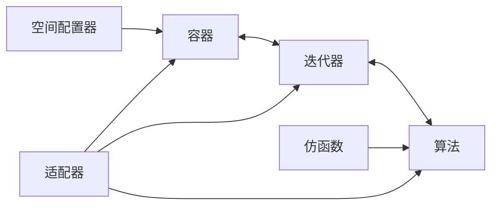

STL从广义上分为：容器，算法和迭代器
容器和算法之间通过迭代器进行无缝连接
STL几乎所有代码都采用了模板类或者模板函数
六大组件：

```mermaid
flowchart LR
  A[空间配置器] --> B[容器]
  B <--> C[迭代器]
  C <--> D[算法]
  E[仿函数] --> D
  F[适配器] --> B
  F --> C
  F --> D
```

容器负责存数据，算法负责算，两者靠迭代器对接；仿函数给算法当策略，适配器改接口，空间配置器管内存。