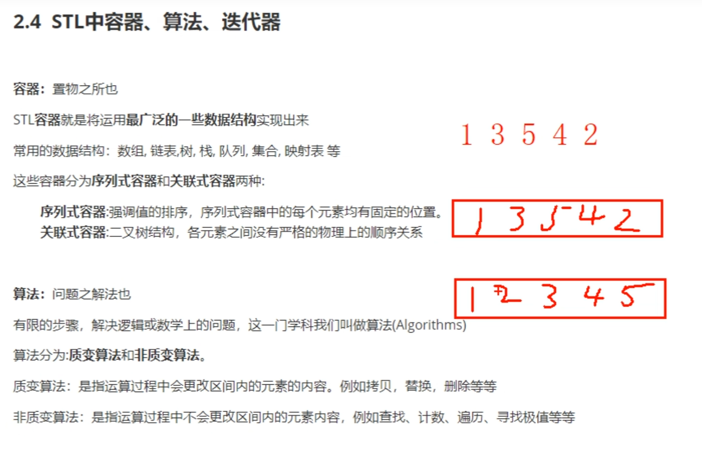
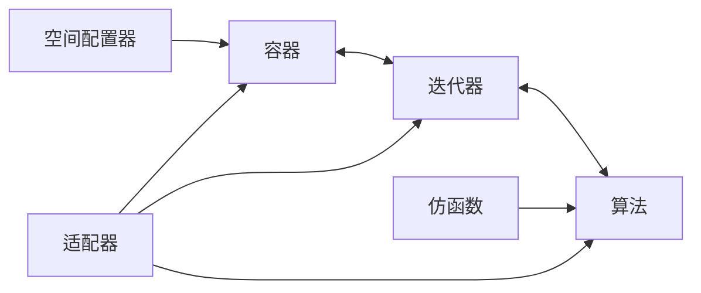

# STL（ Standard Template Library，标准模板库）

从广义上分为：容器、算法、迭代器。容器和算法靠迭代器对接。几乎所有代码都是模板类或模板函数。

六大组件：
<!-- more -->

```mermaid
flowchart LR
  A[空间配置器] --> B[容器]
  B <--> C[迭代器]
  C <--> D[算法]
  E[仿函数] --> D
  F[适配器] --> B
  F --> C
  F --> D
```

容器负责存数据，算法负责算，两者靠迭代器对接；仿函数给算法当策略，适配器改接口，空间配置器管内存。