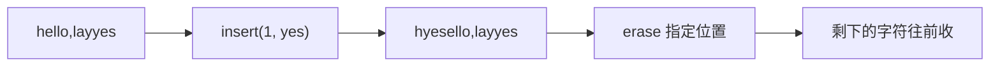

## 构造函数

## 赋值操作

## 字符串拼接

## 字符串查找和替换

## 字符串比较

## 字符存取

string中单个字符存取方式有两种
`char& operator[](int n) //通过[]方式取字符`
`char& at(int n)   //通过at方法获取字符`

```cpp
# include <iostream>
# include <string>
using namespace std;
int main() {
	string n = "i will remember you , wmx.";
	// 使用[]方法
	for (int i = 0; i < n.size(); i++) {
		cout << n[i];
	}
	cout << endl;
	// 使用at方法
	for (int i = 0; i < n.size(); i++) {
		cout << n.at(i);
	}
	cout << endl;

	//修改
	n[2] = 'p';
	cout << n;
	
	cout << endl;

	n.at(3) = 'v';
	cout << n;
	return 0;
}
```

## 字符串插入与删除

对 string 字符串进行插入和删除字符的操作。`insert` 把新片段塞进指定下标，后面的字符往后挪；`erase` 则从指定位置抠掉一段。



```cpp
# include <iostream>
using namespace std;

int main() {
	string str = "hello,layyes";
	cout << "str = " << str << endl;

	// 插入
	str.insert(1, "yes");
	cout << str << endl;
	
	// 删除
	str.erase(1, 3);
	cout << str << endl;
	return 0;
}
```

## string 子串

从字符串中获取想要的子串
`string substr(int pos = 0, int n = npos) const  // 返回由pos开始的n个字符组成的字符串`


 
