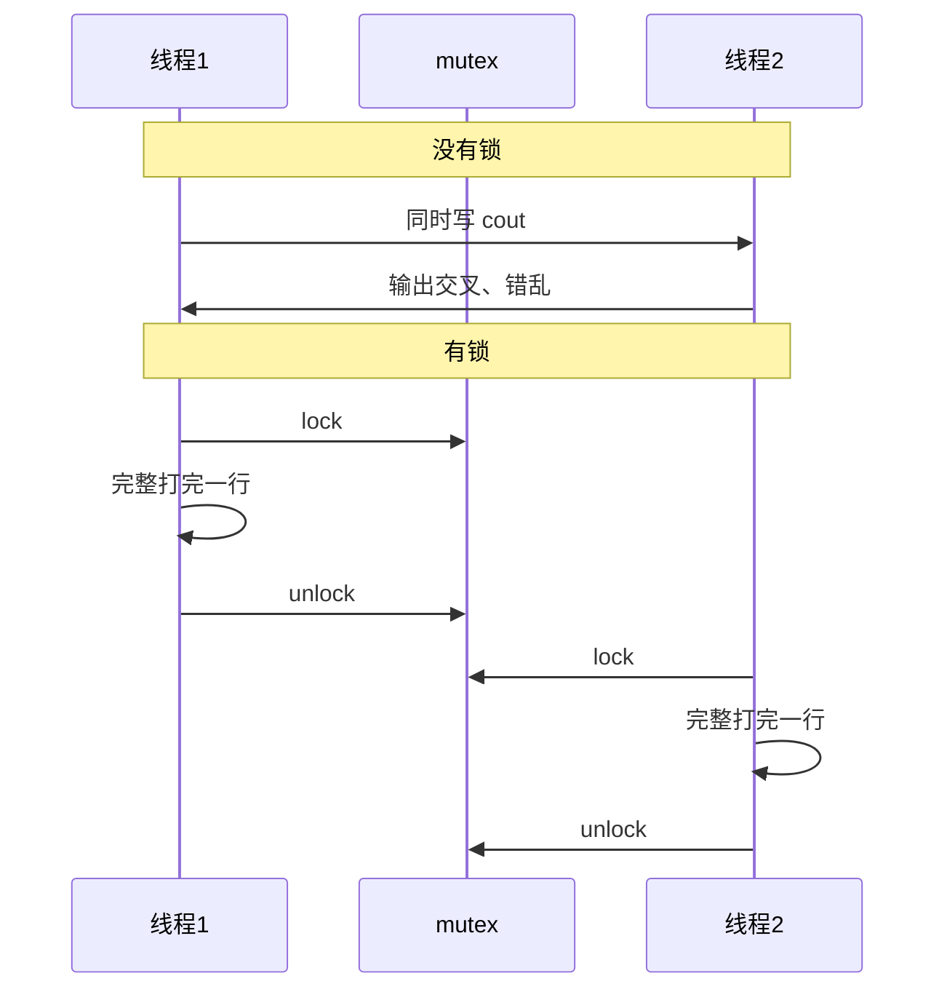

在多线程编程中，当多个线程同时访问同一个共享资源（比如控制台输出 `std::cout`、全局变量、文件等）时，就会发生冲突。互斥锁就是用来解决这个冲突的核心工具
如果没有互斥锁，多个任务同时抢 `cout`，控制台会搅在一起：



非常混乱，所以有了互斥锁就能让它们正常访问了，那么它是怎么被使用的呢？
## 互斥锁原理


我们可以把互斥锁想象成**一个带锁的房间，里面放着共享资源**。

- 🚪 房间在同一时间**只能容纳一个人**（一个线程）。
    
- 🔑 房间门口有一把**钥匙**（`std::mutex` 对象）。
    

当一个线程想要访问共享资源时，它必须经历以下三个步骤：

|**步骤**|**代码操作**|**发生的事情**|
|---|---|---|
|**1. 申请钥匙**|`mtx.lock();`|如果钥匙在门口，该线程拿走钥匙进屋。如果钥匙已经被别人拿走了，它就必须在门口**阻塞等待**（挂起），直到别人把钥匙还回来。|
|**2. 使用资源**|`std::cout << ...`|线程安全地执行打印或其他操作，此时绝不会有其他线程来打扰。|
|**3. 归还钥匙**|`mtx.unlock();`|线程离开房间，把钥匙放回门口。此时正在等待的其他线程会开始抢这把钥匙。|

### 使用 `lock()` 和 `unlock()` 的潜在风险

虽然直接使用 `lock()` 和 `unlock()` 很直观，但在实际开发中，它存在一个非常致命的隐患：**死锁或忘记解锁**

比如：
```cpp
void work() {
    mtx.lock();
    // 执行一些业务逻辑...
    
    if (条件不满足) {
        return; // 提前退出了！忘记调用 mtx.unlock()！
    }
    
    mtx.unlock();
}
```

如果程序因为 `return`、`break` 或者抛出异常而提前结束，导致 `unlock()` 没有被执行，那么这把钥匙就永远消失了。其他所有等待这把锁的线程都将**永远卡死**...

为了解决这个问题，C++11 引入了一种聪明的机制——**`std::lock_guard`**。它利用了对象的生命周期来自动管理锁：**构造时自动上锁，析构（生命周期结束）时自动解锁**。这样一看，这不就是[RAII](/knowledge-base/knowledge/C和C++/RAII.md)？
以[C++线程](/knowledge-base/knowledge/C和C++/C++线程.md)中的代码为例：
```cpp
#include <mutex>

std::mutex mtx; // 全局锁

void work1(int i) {
    for (; i < 10; ++i) {
        {
            // 用大括号限制锁的生命周期
            std::lock_guard<std::mutex> lock(mtx); // 🔒 构造时自动上锁
            
            std::cout << "今天是第" << i << "天，继续努力\n";
            
        } // 🔓 出了这个大括号，lock 变量被销毁，自动执行解锁！

        time(1000); // 耗时操作依然在锁外面并发执行
    }
}
```


## 互斥锁的使用

首先需要声明头文件`#include <mutex>`
然后在函数外创建一个全局的互斥锁`std::mutex mtx;`
就能使用`mtx.lock()`和`mtx.unlock()`来控制了
至于提到的潜在风险，如果是仿函数，我们这样做：
```cpp
 //仿函数
class AA {
public:
	//重载()
	void operator()() {
		std::lock_guard<std::mutex> lock(mtx); //在此上锁
		std::cout << "仿函数开始干活\n";
		for (int i = 1; i < 10; ++i) {
			
			std::cout << "仿函数工作第" << i << "次\n";
		}
		std::cout << "仿函数干活完毕" << std::endl;
	}
};
```
这样可以吗？打印后发现虽然确实工整了，但是又本末倒置了。也就是说，如果把锁加在整个函数的最外层，仿函数一拿到钥匙，就会把里面所有的代码（包括循环和打印）一口气执行完才肯把钥匙还回去。

这样会带来两个严重的问题：

1. **失去并发意义**：当仿函数在执行时，其他线程只能在外面傻傻地排队。这让多线程退化成了**单线程**，完全失去了并发提高效率的初衷。
    
2. **输出依然不均匀**：仿函数会把自己的 9 次工作全部连续打印完，其他线程才能打印，这就失去了“大家一起交替干活”的效果。

为了让多线程既能“守规矩”排队打印，又能“互不干扰”地并发休息，我们应该**只锁住真正需要保护的共享资源（即 `std::cout` 那一行）**。

使用 `std::lock_guard` 时，我们可以利用**局部大括号 `{}`** 来精确控制锁的生命周期（构造时上锁，出大括号析构时自动解锁）。

```cpp
 //仿函数
class AA {
public:
	//重载()
	void operator()() {
		{
			std::lock_guard<std::mutex> lock(mtx); //在此上锁
			std::cout << "仿函数开始干活\n";
		}
		for (int i = 1; i < 10; ++i) {
			
			{
				std::lock_guard<std::mutex> lock(mtx);
				std::cout << "仿函数工作第" << i << "次\n";
			}
		}
		{
			std::lock_guard<std::mutex> lock(mtx);
			std::cout << "仿函数干活完毕" << std::endl;
		}
		
	}
};
```
这样写就正确了。

## 关于开锁关锁时机

有时候我会想，为什么只在`std::cout`才加上锁，而不是在`time(1000)`（模拟干活消耗时间）呢？
这就是多线程编程中关于锁的粒度（Lock Granularity）的核心概念。

如果在 `for` 循环的最外层直接套上 `std::lock_guard`，这个线程就会在整个循环期间（包括整整 10 秒的 `time(1000)` 延时期间）一直死死攥着那把钥匙。

这会导致以下后果：

1.  **其他线程集体“失业”**：当这个线程在默默睡觉（`time(1000)`）时，它并不需要输出，但由于锁没释放，其他需要输出的线程也只能在外面干等。
    
2.  **多线程变单线程**：原本大家可以同时各睡各的（并发执行），现在变成了一个人睡完下一个人才能睡，程序耗时会成倍增加。
    

所以，正如我们所说，**在不需要输出（比如执行耗时计算或等待）的时候，应该把锁留给其他需要输出的线程**。让锁的范围尽可能小，只包裹 `std::cout` 那一行，这就是“细粒度锁”，也是多线程保持高效并发的秘诀。

在C++线程中的代码更新好后如下：
```cpp
#include <iostream>
#include <thread>
#include <mutex>

std::mutex mtx;

void time(int ms) {
std::this_thread::sleep_for(std::chrono::milliseconds(ms));
}

void work1(int i) {
	for (; i < 10; ++i) {
		mtx.lock(); //拿到钥匙
		std::cout << "[普通work1函数]今天是第" << i << "天，继续努力\n";
		mtx.unlock();//打印完毕，让其他线程接手
		time(1000);
	}
}

void work2(int i) {
	for (; i < 10; ++i) {
		mtx.lock();
		std::cout << "执行任务\n";
		mtx.unlock();
		time(1000);
	}
	mtx.lock();
	std::cout << "任务结束\n";
	mtx.unlock();
}

class Work {
public:
	void work3(int i) {
		for (; i < 10; ++i) {
			mtx.lock();
			std::cout << "今天是我想你的第"<< i << "天\n";
			mtx.unlock();
			time(1000);
		}
		mtx.lock();
		std::cout << "不想你了\n";
		mtx.unlock();
	}
	static 	void work4(int i) {
		for (; i < 10; ++i) {
			mtx.lock();
			std::cout << "静态成员函数进行工作的第" << i << "次\n";
			mtx.unlock();
			time(1000);
		}
		mtx.lock();
		std::cout << "静态成员函数工作结束\n";
		mtx.unlock();
	}

};
 //仿函数
class AA {
public:
	//重载()
	void operator()() {
		{
			std::lock_guard<std::mutex> lock(mtx); //在此上锁
			std::cout << "仿函数开始干活\n";
		}
		for (int i = 1; i < 10; ++i) {
			
			{
				std::lock_guard<std::mutex> lock(mtx);
				std::cout << "仿函数工作第" << i << "次\n";
			}
		}
		{
			std::lock_guard<std::mutex> lock(mtx);
			std::cout << "仿函数干活完毕" << std::endl;
		}
		
	}
};

int main() {
	
	auto f = [](int i) {
		for (; i < 10; ++i) {
			mtx.lock();
			std::cout << "[Lambda线程] 今天是第" << i << "天，继续努力\n";
			mtx.unlock();
			time(1000);
		}
	};
	//使用匿名函数来创建线程
	std::thread t1(f, 0);
	//普通函数
	std::thread t2(work2, 0);
	//普通函数
	std::thread t3(work1, 0);
	//类的普通成员函数创建线程
	Work work;//需要先实例化一个对象且保证对象生命周期比子线程要长
	std::thread t4(&Work::work3, &work, 1);//第二个参数是对象的this指针
	//类的静态成员函数创建线程
	std::thread t5(Work::work4, 1);
	//仿函数创建线程
	std::thread t6{ AA() }; //方案一
	//std::thread t6((AA()));//方案二
	/*AA aa;
	std::thread t6(aa);*/ //方案三
	t1.join();//此为回收线程
	t2.join();//此为回收线程
	t3.join();//此为回收线程
	t4.join();
	t5.join();
	t6.join();
}
```
