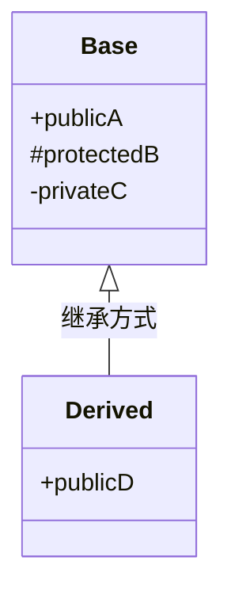
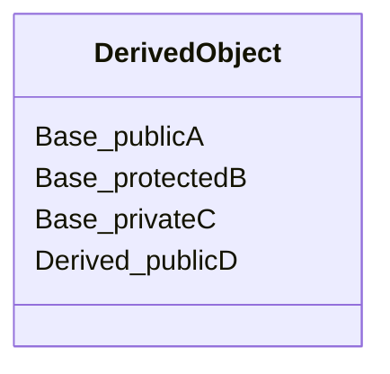

首先上语法：`class 子类 ： 继承方式`
子类也叫做派生类，父类也叫基类



在黑马的视频上看到了这个对象模型：子类对象里会先摆父类成员，再摆自己的成员。`private` 成员照样占内存，只是子类里看不见。



用开发人员命令提示工具看对象模型时，布局就是上面这样：父类那一块在前，子类在后。
如果子类中有和父类一样的同名成员函数，则它会隐藏掉父类的所有同名成员函数。解决方法是加入类作用域。


## 类和对象-继承-基本语法
- **核心概念**：继承解决什么问题（代码复用），`class 子类 : 继承方式 父类`。
- **代码示例**：
- **注意事项**：

## 类和对象-继承-继承方式
- **核心概念**：`public`、`protected`、`private` 三种继承方式的区别。
- **权限速查表**：父类成员在不同继承方式下，在子类中的权限变化。

## 类和对象-继承-继承中的对象模型
- **底层原理**：父类中被隐藏的 `private` 成员是否被继承？（占用内存但不可见）。
- **验证工具**：使用开发者命令提示符查看对象内存布局。

## 类和对象-继承-构造和析构顺序
- **核心概念**：先有父还是先有子？（父类构造 -> 子类构造 -> 子类析构 -> 父类析构）。
- **代码验证**：

## 类和对象-继承-同名成员处理
- **核心概念**：子类和父类有同名变量/函数时，如何分别访问？
- **语法规范**：访问子类直接 `.`，访问父类加作用域 `::`。

## 类和对象-继承-同名静态成员处理
- **核心概念**：静态成员的同名处理机制（与非静态类似，但可通过类名直接访问）。
- **代码示例**：

## 类和对象-继承-多继承语法
- **核心概念**：一个子类继承多个父类 `class 子类 : 继承方式 父类1, 继承方式 父类2`。
- **易错点**：多继承容易引发同名成员歧义（菱形继承问题的前置），需加作用域区分。

## 类和对象-继承-菱形继承问题以及解决方法
- **核心概念**：两个派生类继承同一个基类，又有个某个类同时继承这两个派生类（如：羊和骆驼继承动物，羊驼继承羊和骆驼）。
- **导致问题**：1. 调用成员时产生二义性；2. 孙子类保留了两份基类数据，造成内存浪费。
- **解决方法**：使用**虚继承**（Virtual Inheritance）。在继承方式前加上 `virtual` 关键字，原本的基类称为**虚基类**。
- **底层原理**：虚继承后，子类内部不再存储重复的基类数据，而是存储**虚基类指针（vbptr）**。该指针指向**虚基表（vbtable）**，表中记录了距离真实基类数据的偏移量，保证公共数据在内存中只有唯一的一份。
- **代码示例**：
```cpp
class Animal { public: int m_Age; };

// 利用 virtual 关键字变成虚继承
class Sheep : virtual public Animal {};
class Camel : virtual public Animal {};

// 羊驼类，完美解决二义性和数据冗余
class Alpaca : public Sheep, public Camel {};
---

## 继承中的构造函数和析构函数（详细）

### 构造/析构顺序

子类对象创建和销毁时，父类和子类的构造/析构谁先谁后？

```cpp
class Base {
public:
    Base() { cout << "Base构造 "; }
    ~Base() { cout << "Base析构 "; }
};

class Derived : public Base {
public:
    Derived() { cout << "Derived构造 "; }
    ~Derived() { cout << "Derived析构 "; }
};
```

执行 `Derived d;` 输出：

```
Base构造 Derived构造 Derived析构 Base析构
```

**规则**：
- **构造**：先父类，再子类（先有地基，再盖房子）
- **析构**：先子类，再父类（先拆装修，再拆地基）—— 与构造**完全相反**

---

### 父类没有默认构造函数时

```cpp
class Base {
public:
    Base(int x) { }  // 带参构造，没有默认构造
};

class Derived : public Base {
public:
    // ❌ 编译错误！父类没有默认构造
    Derived() { }

    // ✅ 正确：用初始化列表（冒号）调用父类带参构造
    Derived() : Base(0) { }
};
```

---

### 虚析构函数

```cpp
class Base {
public:
    ~Base() { cout << "Base析构 "; }   // ❌ 非虚
};

class Derived : public Base {
public:
    ~Derived() { cout << "Derived析构 "; }
};

Base* p = new Derived();
delete p;  // 输出：Base析构   ← 子类析构没调！内存泄漏！
```

**解决方法**：父类析构加 `virtual`

```cpp
class Base {
public:
    virtual ~Base() { cout << "Base析构 "; }
};

Base* p = new Derived();
delete p;  // 输出：Derived析构 Base析构 ✅
```

> **规则**：只要一个类会被继承，就把析构函数写成 `virtual`。

---

### 继承中的拷贝构造

```cpp
class Base {
public:
    Base() { }
    Base(const Base& other) { cout << "Base拷贝构造 "; }
};

class Derived : public Base {
public:
    // 子类拷贝构造中显式调用父类拷贝构造
    Derived(const Derived& other) : Base(other) {
        cout << "Derived拷贝构造 ";
    }
};
```

注意 `: Base(other)` —— 子类拷贝时，父类部分也要拷贝，否则父类部分只会默认构造。
