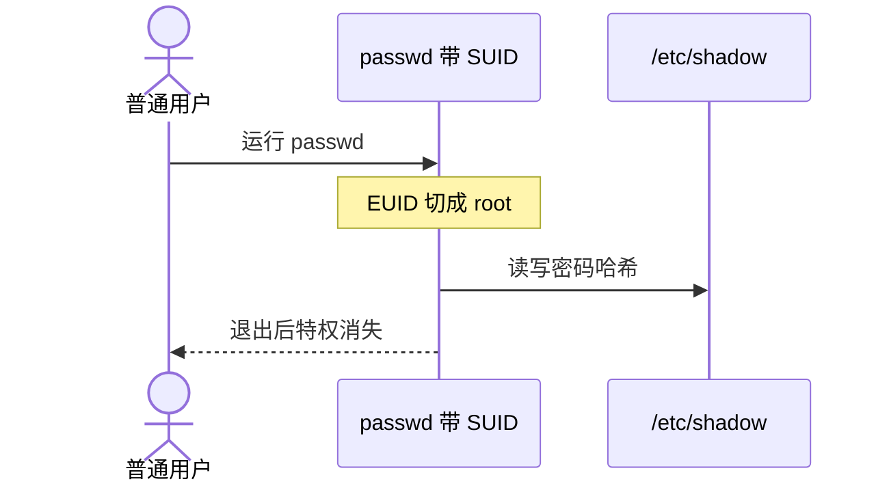

Linux 中的 **SUID（Set User ID）** 是一种特殊的权限标志位。它是 Linux 权限架构中为了解决“**普通用户需要临时执行某些只有特权用户才能完成的任务**”而设计的机制。

## 一、 SUID 的工作机制

在标准的 Linux 权限模型中，当一个用户运行某个可执行文件时，产生的进程会继承该用户的权限，即进程的 **有效用户 ID（EUID, Effective User ID）** 等于发起人的用户 ID（RUID, Real User ID）。
SUID 的本质改变了这一逻辑：

当某个可执行文件被赋予了 SUID 位后，无论**谁**来运行这个程序，该程序在运行期间所产生的进程，其 **EUID 都会被强制设置为该文件所有者（Owner）的 ID**，而不是运行者的 ID。



举个例子吧：修改密码的 `/usr/bin/passwd`

普通用户需要通过 `passwd` 命令修改自己的密码，而密码哈希存放在 `/etc/shadow` 文件中。按照正常权限，`/etc/shadow` 只有 `root` 才能读写（权限通常为 `-rw-------`）。

查看 `passwd` 命令的权限：
```bash
ls -l /usr/bin/passwd
# 输出：-rwsr-xr-x 1 root root 68208 Jan  1 10:00 /usr/bin/passwd
```
注意所有者权限中的 **`s`**（取代了原本的 `x`）：这就是 SUID 标志位

当普通用户运行 `passwd` 时，内核识别到 `s` 位，把该进程的 EUID 切换为 `root`（UID 0），从而拥有了修改 `/etc/shadow` 的权限；修改完成后程序退出，特权随之销毁。

## 二、 SUID 的设置与查看

在 Linux 中，标准权限由读（4）、写（2）、执行（1）三组数字表示。特殊权限（包括 SUID、SGID、Sticky Bit）占据最高位，其中 **SUID 的数值为 4**。

- 赋予SUID：
```bash
chmod u+s /path/to/file
# 或使用八进制（4 表示 SUID）：
chmod 4755 /path/to/file
```

- 取消SUID
```bash
chmod u-s /path/to/file
# 或：
chmod 0755 /path/to/file
```

- 特殊符号的区别
	- **`s`（小写）**：说明文件同时拥有 **SUID 位** 和 **执行权限（x）**，机制正常生效。
    
	- **`S`（大写）**：说明文件设置了 **SUID 位**，但**缺乏执行权限（x）**，此时 SUID 无效（配置错误）。

## 三、 SUID 带来的安全风险与提权机制

既然已经了解了SUID机制，那么是不是可以利用这一点进行安全攻击呢？答案是**肯定**。SUID 就像把一张“临时特权通行证”绑在了一个文件上。如果这个文件存在安全漏洞或设计缺陷，攻击者就能借此实现 **Local Privilege Escalation（本地权限提升 / 提权）**，直接拿到系统的 `root` 权限。

没想到从这个机制也能学习到有关安全的知识，所以顺便搜索整理了一下常见的风险点以及提权的路径：

### 1.不当赋值（危险程序被赋予 SUID）

如果管理员错误地给某些功能过于强大的命令设置了 SUID（例如 `find`、`vim`、`bash`、`python` 等）：
- **`find` 提权**：`find` 包含 `-exec` 参数，可以执行任意系统命令。如果 `find` 是 SUID-root，运行 `find . -exec /bin/sh \;` 就能直接弹出 root shell。
- **`vim` / `nano` 提权**：如果文本编辑器拥有 SUID-root，用户可以打开并任意修改 `/etc/sudoers` 或 `/etc/passwd`，直接将自己加入超级用户组。

### 2.环境变量与 PATH 劫持

如果一个 SUID 程序在内部使用了**相对路径**去调用其他系统命令（例如在 C 语言代码里写了 `system("ls")` 而非 `system("/bin/ls")`）：

- 攻击者可以自己在 `/tmp` 目录下写一个恶意的 `ls` 脚本（内含提权命令）。
- 将 `/tmp` 加入当前用户的 `PATH` 环境变量首位：`export PATH=/tmp:$PATH`。
- 运行时，SUID 程序就会以 `root` 身份去触发攻击者放置的恶意 `ls`。

### 3.Shell 脚本与 SUID（系统层的防护）

现代 Linux 内核（如 Linux Kernel 2.0+ 之后）默认**忽略 Bash / Shell 脚本上的 SUID 位**。因为 Shell 脚本是解释型语言，解释器启动和脚本读取之间存在时间差，极易遭受 **TOCTOU（检查时间到使用时间）** 竞态条件攻击及环境变量注入。


经过以上的总结，我觉得要如何预防也已经非常明显了...整理一下。

## 四、 如何防范 SUID 安全隐患？

1.**定期审计系统中的 SUID 文件** 通过以下命令查找系统中所有带有 SUID 位的二进制文件：
```bash
find / -perm -4000 -type f -exec ls -ld {} \; 2>/dev/null
```
将结果与 GTFOBins（专门记录可用于提权的二进制文件数据库）对比，清理非必要的 SUID 属性。

2.**遵循最小权限原则** 优先使用 `sudo` 并通过 `/etc/sudoers` 精细化控制特定用户能执行的具体命令，避免随意给程序打上 `u+s` 标志。

3.**挂载点安全参数（`nosuid`）** 对允许普通用户挂载的分区（如 `/tmp`、`/home` 或外接 U 盘），在 `/etc/fstab` 挂载选项中加上 `nosuid`。加上后，哪怕分区内存在带 SUID 位的程序，系统内核也会强制忽略其提权效果。
