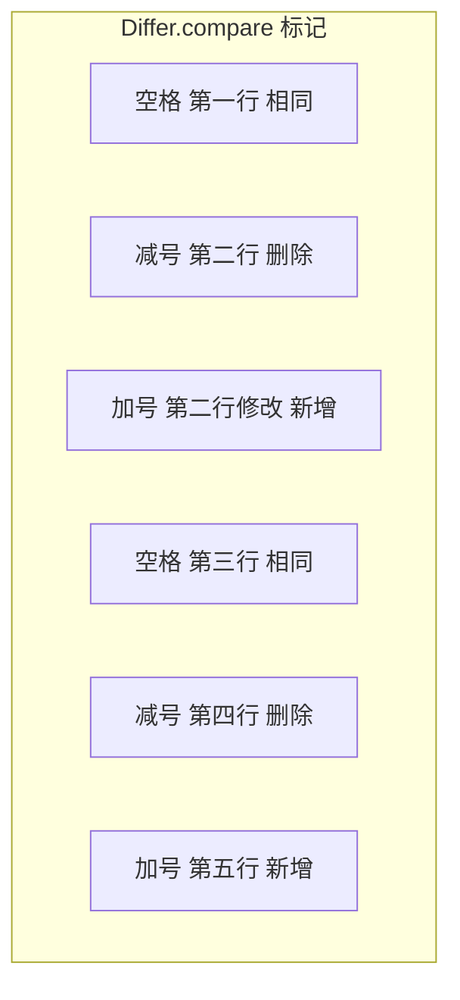
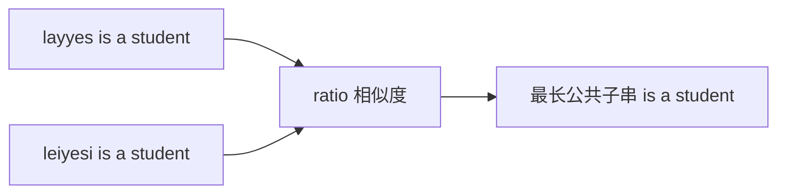
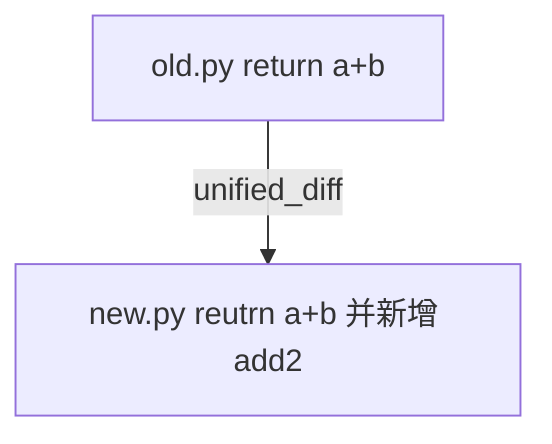
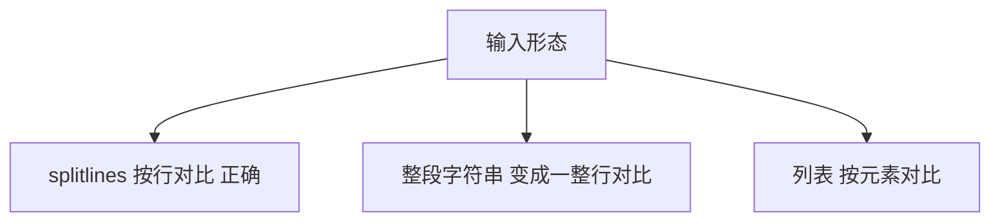

[Python官方文档](https://docs.python.org/zh-cn/3.14/library/difflib.html#sequencematcher-objects)

# 关于

##  `difflib.unified_diff`
### 作用

比较两个由「行」组成的序列 `a` 和 `b`（通常是 `readlines()` 或 `text.splitlines(keepends=True)` 的结果），产出 unified diff 格式的多行文本，逐行说明：哪些行未改、哪些只在旧里有、哪些只在新里有。

### 签名（Python 3）
```Python
difflib.unified_diff(
    a, b,
    fromfile='', tofile='',
    fromfiledate='', tofiledate='',
    n=3,
    lineterm='\n',
)
```

|参数|含义|
|---|---|
|`a`, `b`|旧版、新版。必须是可迭代的「行」序列，每个元素一般是一整行字符串（通常带 `\n` 结尾，和 `readlines()` 一致）。|
|`fromfile`, `tofile`|出现在 diff 头里的逻辑文件名（`--- old`、`+++ new`），方便人读；不必是真路径。配置对比里常写成 `backup_old.cfg` / `backup_new.cfg`。|
|`fromfiledate`, `tofiledate`|可选的「修改时间」字符串，会出现在部分 diff 头里；不配就空。|
|`n`|上下文行数：每个改动块前后各附带几行未改行，默认 3。`n` 越大，补丁越长、越容易读懂；越小越紧凑。|
|`lineterm`|生成每一行末尾用什么换行。默认 `'\n'`。若你的输入行没有行尾 `\n`，有时要设成 `''`，避免「多出一个空行」之类的问题（文档里有说明）。|

### 返回值

返回一个 [generator](/knowledge-base/knowledge/Python/generator.md)（生成器），每次 [yield](/knowledge-base/knowledge/Python/yield.md) 一行字符串（含换行）。  
常见用法：
```Python
lines = difflib.unified_diff(a, b, fromfile="old.cfg", tofile="new.cfg", n=3)

text = "".join(lines) # 拼成一整段 diff 文本
```

或者：
```Python
import sys

sys.stdout.writelines(lines) # 直接打印
```

### 输出

典型结构：

1. `--- fromfile` / `+++ tofile`：                            标明「旧」「新」是谁。
2. `@@ -旧起始,旧行数 +新起始,新行数 @@`：                   **一个 hunk（一块连续变更区域）**在两边各覆盖多少行。

3. hunk 里每一行一个前缀：
    - 空格：两边都有（上下文）；
    - `-`：只在 `a`（旧）里；
    - `+`：只在 `b`（新）里。

这就是 「unified diff」：补丁风格、行级、适合日志/文本报告/给 `patch` 类工具看。


## 类 `difflib.HtmlDiff`

### 作用

比较两个由「行」组成的序列 `a` 和 `b`，产出 unified diff 格式的多行文本，逐行说明：哪些行未改、哪些只在旧里有、哪些只在新里有。

### 签名（Python 3）

```Python
difflib.HtmlDiff(
    tabsize=8,
    wrapcolumn=None,
    linejunk=None,
    charjunk=IS_CHARACTER_JUNK,
)
```

| 参数                      | 含义                                            |
| ----------------------- | --------------------------------------------- |
| `tabsize`               | 把 Tab 展成空格时用的宽度；和设备配置里 Tab 对齐有关。              |
| `wrapcolumn`            | 若指定列宽，超长行会折行再参与对比/展示；`None` 表示不强制折行。          |
| `linejunk` / `charjunk` | 传给内部的 `ndiff`，用来定义「哪些行/字符算噪音可忽略」；上午计划一般用默认即可。 |
### 方法 `make_table(...)`

```Python
make_table(
    fromlines, tolines,
    fromdesc='', todesc='',
    context=False,
    numlines=5,
)
```

|参数|含义|
|---|---|
|`fromlines`, `tolines`|左右两列的源文本，仍是行列表（建议与 `unified_diff` 一样用 `splitlines(keepends=True)` 或 `readlines()`，风格统一）。|
|`fromdesc`, `todesc`|表头里显示的名字（如 `backup_old.cfg` / `backup_new.cfg`）。|
|`context`|`False`：全文对比（大文件会很长）；`True`：只显示变更附近若干上下文，类似「浓缩版」并排视图。|
|`numlines`|与 `context` 配合：在「上下文模式」下表示变更前后保留几行；在全文模式下还会影响「下一处差异」跳转锚点附近的展示（细节以官方文档为准）。|
返回值：一个 `str`，内容是 `<table class="diff" ...>...</table>`（只是一张表，不是完整 HTML 文档）。


### (推荐)方法 `make_file(...)`

参数与 `make_table` 类似，另外常见有：
```Python
make_file(..., *, charset='utf-8')
```
返回值：完整 HTML 文档字符串（含 `<!DOCTYPE>`、`<meta charset=...>`、内联 CSS、表、以及底部的 图例说明颜色含义）。  
适合「一个文件丢进浏览器就能看」，也适合做成「差异报告」的底稿。


## 应用：「读配置文件」

流程一般是：

1. `open(old_path, encoding="utf-8").readlines()` → `old_lines`
2. `open(new_path, encoding="utf-8").readlines()` → `new_lines`
3. `unified_diff(old_lines, new_lines, ...)` → 写入 `.txt` 或日志；
4. `HtmlDiff().make_table(old_lines, new_lines, ...)` → 写入 `.html` 或交给模板。

要点：`unified_diff` 和 `HtmlDiff` 要的输入形态一致——按行的字符串序列；不要混用「整篇一个大字符串」和「行列表」，否则 diff 会变成「一整行」对比，失去行级意义。


## 练习(如何使用)

以下均默认导入了`difflib`库


### 1.带标记的逐行检查

```Python
# 先准备一下两个不一样的文本内容

text1= """
    第一行,
    第二行,
    第三行,
    第四行
"""

text2= """
    第一行,
    第二行修改,
    第三行,
    第五行
"""
# 首先对Differ对象进行初始化,创建实例
d = difflib.Differ()
# 差异化比较两个对象

d_res= d.compare(text1.splitlines(), text2.splitlines())
print("======")
print("\n".join(d_res)) # 这行代码的作用将差异化的结果列表d_res通过换行符连接成一个字符串，并打印出来
print("\n======")
```
输出:




### 2.计算序列相似度和最长公共子串

```Python
# 字符串的相似度计算
a= "layyes is a student"
b= "leiyesi is a student"

# 初始化
s = difflib.SequenceMatcher(None, a, b)  #None: 这是第一个参数，通常是isjunk函数，用于忽略某些字符。在这个例子中，设置为None意味着不使用任何isjunk函数，即不忽略任何字符。
# a: 第二个参数是要比较的第一个字符串序列。
# b: 第三个参数是要比较的第二个字符串序列。
# 进行计算
number = s.ratio()
print(f"a和b字符串相似度计算结果为：{float(number)*100:.2f}%")
match = s.find_longest_match(0, len(a),0,len(b))
print(f"a和b字符串的公共子串：{match}")
print(f"a和b字符串的公共子串:a[{match.a}] b[{match.b}] 长度{match.size}")
print(f"a和b字符串的公共子串内容:{a[match.a:match.a+match.size]}")
```
输出：



### 3. 生成统一格式差异（unified_diff）

```Python
# 如何生成统一格式的差异
old_lines= ["def add(a,b):", "    return a+b", ""]
new_lines= ["def add(a,b):", "    reutrn a+b", "def add2(a,b):", "    return a+b"]

# 进行差异
diff = difflib.unified_diff(
    old_lines,new_lines,fromfile="old.py",tofile="new.py",lineterm=""
)
print("统一格式差异报告:")
print("\n".join(diff))
```
输出：



### 4. HTML差异报告（HtmlDiff） 
```Python
# 生成HTML格式差异化报告
text1= """
    Python is a great language.
    It's easy to study.
""".splitlines()

text2= """
    Python is a powerful language.
    It's easy and beautiful language.
""".splitlines()

# 生成html差异化报告
html_diff = difflib.HtmlDiff()
html_context= html_diff.make_file(
    text1, text2, fromdesc="旧版本", todesc="新版本"
)

with open("example_html_different_new_new.html", "w", encoding="utf-8") as f:
    f.write(html_context)
    print("结束")
```
输出：浏览器打开生成的 HTML，左右对照旧版本 / 新版本。

关于这个我尝试了三种写法生成了三种html文件，上述只是最终版本，其他两种分别有以下差异：

