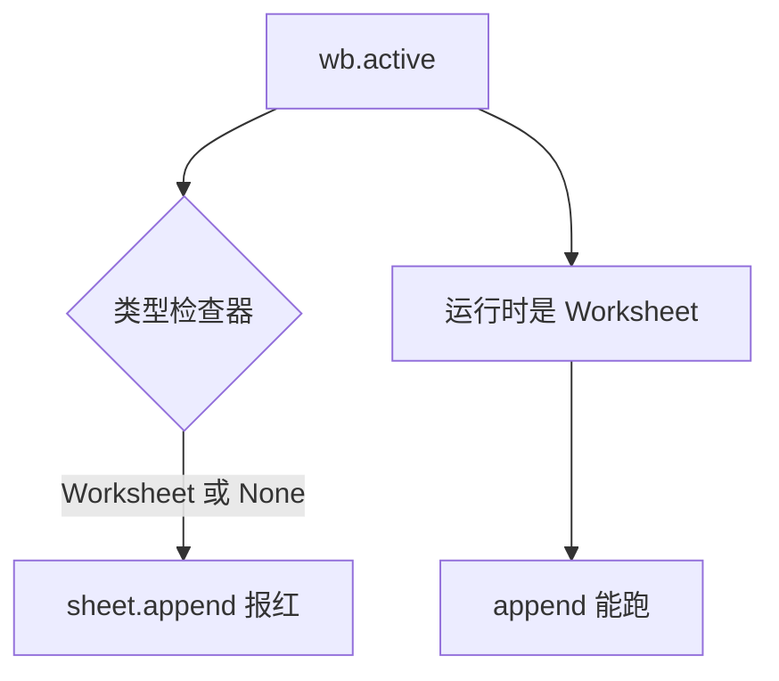

## 现象

进行openpyxl库写入excel文件测试代码时：

```Python
import openpyxl as op
from pathlib import Path

devices = [
    ["layyes", "127.0.0.1", "root", "root", "k", "正常"]
]

path = Path.cwd() / "devices.xlsx"

wb = op.load_workbook(path)

sheet = wb.active
if sheet is None:
    print("sheet为空")
else:
    for row in sheet.iter_rows(values_only=True):
        print(row)
  
for device in devices:
        sheet.append(device)
        print(device)
```
看起来似乎一切正常，是吧？



但是还是有个小红线，但是运行却又能正常运行，这是为什么？

### 问题本质

经过查阅资源和AI，我得知这是类型检查器（Type Checker）误报，并不是代码真正运行错误。那又为什么会误报呢？

### 原因分析

上述代码中`wb.active`理论上应该返`Worksheet`，但是类型检查器却认为：`Worksheet | None`，即有可能是空的，所以才会出现这个问题，但我们知道它不是空的，`wb.active`正常情况会返回活动工作表，所以`sheet.append()`运行时才会没问题

## Python 是动态类型语言

这个问题也能看出python其实就是动态类型语言，而IDE只是“推测”类型