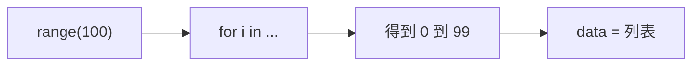
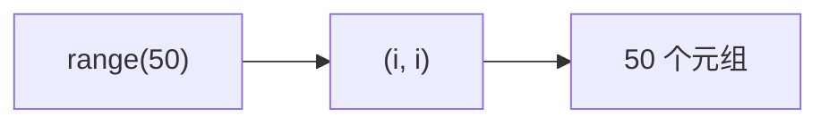

今天在学习[concurrent.futures模块](/knowledge-base/knowledge/Python/concurrent.futures模块.md)时用列表生成测试数据偶然发现：

然后去搜索了一下：这个语句 data = [i for i in range(100)] 使用了 Python 的列表生成式（list comprehension）语法，作用是创建一个0（包含）到99的整数列表
range(100) 生成一个从 0 开始，到 99 结束的整数序列。[i for i in range(100)] 表示对于 range(100) 生成的每一个整数 i，将其添加到列表中。data = [...] 将生成的列表赋值给变量 data。
然后：

这段代码的主要功能是生成一个包含50个元组的列表，每个元组的形式为 (i, i)，其中 i 是从0到49的整数。
然后后面考