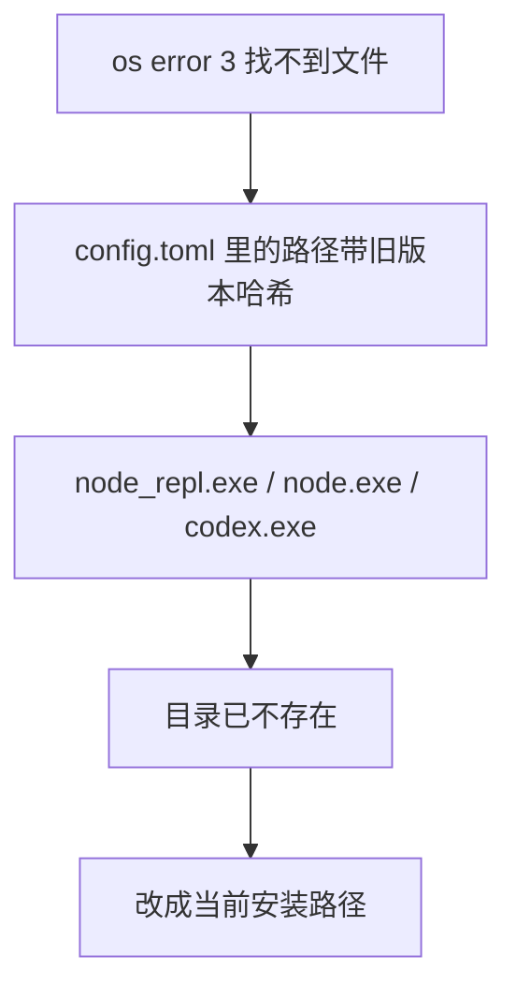

今天登录codex发现了以下问题：
<!-- more -->

经过查阅和修复，根因为：配置中的 node_repl.exe、node.exe 和 codex.exe 都指向带版本哈希的旧安装目录；其中至少 node_repl.exe 的目录已不存在，因此 Windows 报 os error 3

排查后发现问题在于：当前安装中可用的文件已确认：node_repl.exe ，codex.exe，而原配置的这两个路径都已失效。
更新 .codex/config.toml 中这两个失效引用即可解决。