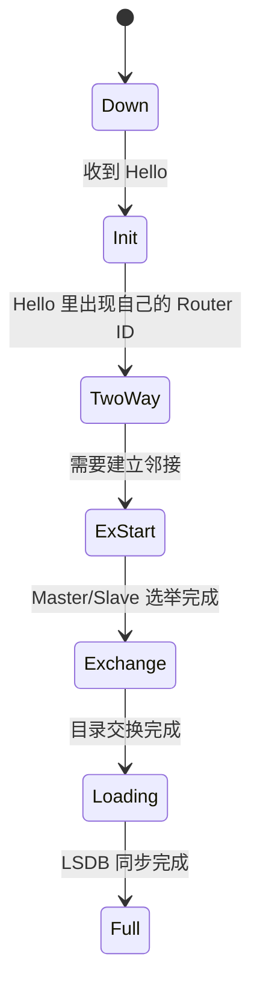
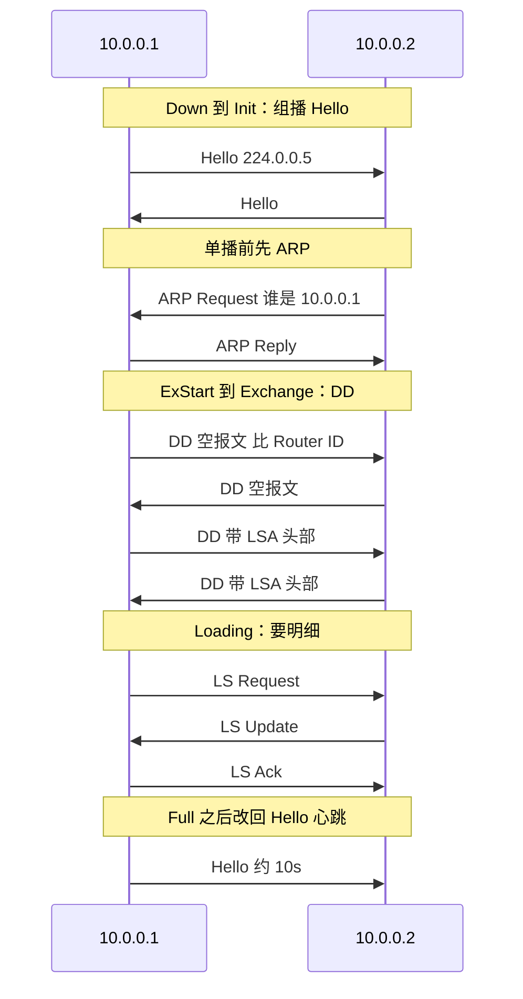

OSPF（Open Shortest Path First， **开放式路径最短优先**）是一种基于链路状态算法的**内部网关协议（[IGP协议](/knowledge-base/knowledge/计算机网络/IGP协议.md)）**，专为大型网络设计。它收敛快、无环路、支持VLSM/CIDR，是目前企业网和数据中心最核心的路由协议。

## 第一层：链路状态本质、Area 0 骨干区、Router ID

### 1. 链路状态协议的本质

与RIP这种**距离矢量协议**（只知道方向+距离）完全不同，OSPF是**链路状态协议**。每台路由器会将自己所有接口的状态（IP、掩码、Cost、邻居关系）以LSA（链路状态通告）的形式在整个区域中泛洪，最终每台路由器都拥有一张完全相同的“网络拓扑图”（LSDB），然后独立运行SPF算法计算去往各个网络的最优路径。

这就像大家都有一张城市地图，自己算路，避免了“道听途说”带来的环路风险。

### 2. Area 0——不可替代的骨干区域

OSPF采用**分区域（Area）管理**，核心规则是：

- **Area 0（骨干区域）必须存在且连续**，所有其他区域都必须直接连接到Area 0。
    
- 区域间流量必须经过骨干区中转，类似“轮毂-辐条”结构。
    
- 分区的好处：把LSA泛洪限制在区域内，减少路由表条目和SPF计算量，网络更稳定。
    

**常见区域类型**：

|区域类型|说明|允许的LSA|
|---|---|---|
|骨干区域（Area 0）|核心，负责区域间路由分发|所有LSA|
|标准区域|普通区域，可包含任何类型LSA|所有LSA|
|末梢区域（Stub）|过滤外部路由，用默认路由替代|1,2,3,不允许4,5|
|完全末梢区域（Totally Stubby）|过滤外部和区域间路由，只用默认路由|1,2,不允许3,4,5|
|NSSA（Not-So-Stubby）|可引入外部路由的末梢区域|1,2,3,7,不允许4,5|

### 3. Router ID —— 路由器的唯一标识

每台OSPF路由器必须有一个Router ID，格式类似IP地址，唯一标识该路由器。选举规则：

1. 手工配置（推荐，稳定可靠）：`router-id x.x.x.x`
    
2. 自动选举：所有Loopback接口中**最高IP地址**
    
3. 无Loopback时：所有物理接口中**最高IP地址**
    

> **生产建议**：手工配置Loopback地址并指定Router ID，避免因接口状态变化导致Router ID变更，破坏邻居关系。

**特点：一旦确定除非设备重置或者OSPF进程重置，否则不会改变**。

---

## 第二层：邻居状态机——从Down到Full的全过程

OSPF路由器在交换LSA之前，必须先经过一套严格的邻居状态变迁，确保双方信息同步。状态机一共7步：

text

Down → Init → 2-Way → ExStart → Exchange → Loading → Full ^b4473b

|状态|含义|标志性事件|
|---|---|---|
|**Down**|初始状态，未收到对方Hello包|发送Hello包（目标224.0.0.5）|
|**Init**|收到Hello包，但**自己的Router ID不在对方的邻居列表**中|收到对方的Hello|
|**2-Way**|双方Hello包中**都看到了对方的Router ID**，双向通信建立|DR/BDR选举在此状态完成|
|**ExStart**|开始协商Master/Slave，确定DD序列号|发送空DD报文，协商主从|
|**Exchange**|交换DD（数据库描述）报文，同步LSA摘要|DD报文携带LSA头信息|
|**Loading**|根据DD比对结果，请求缺失或更新的LSA|发送LSR（链路状态请求）|
|**Full**|双方LSDB完全同步，邻居关系建立成功|发送LSAck确认，链路状态数据库一致|

**关于DR/BDR**：

- 在**广播多路访问网络**（如以太网）中，为减少LSA泛洪，选举DR（指定路由器）和BDR（备份DR），其他路由器（DRother）只与DR/BDR建立Full邻接，彼此间停留在2-Way。
    
- 点到点链路无需DR/BDR，直接进入Full状态。
    

---

## 第三层：LSA 五种核心类型

LSA是OSPF的灵魂。了解它们的发起者、传播范围和内容，是排查OSPF故障的关键。

|类型|名称|通告者|传播范围|包含内容|
|---|---|---|---|---|
|**1类**|Router-LSA|每台路由器|本区域内|路由器在区域内的链路状态（接口、邻居、Cost），描述“我是谁，我连到哪里”|
|**2类**|Network-LSA|DR|本区域内|描述多路访问网络上有哪些路由器，配合1类描绘拓扑|
|**3类**|Summary-LSA|ABR|整个自治系统（区域间）|ABR将A区域的路由汇总后通告到B区域，描述“去其他区域怎么走”|
|**4类**|ASBR Summary-LSA|ABR|除ASBR所在区域外的所有区域|告知其他区域**ASBR的位置**（去往ASBR的路由）|
|**5类**|External-LSA|ASBR|整个自治系统（除Stub/NSSA）|从其他路由协议（静态、RIP等）重分发进来的外部路由|

> **LSA 7类**（NSSA专用）：在NSSA区域内替代5类LSA，由ASBR发出，传播仅限NSSA区域，离开该区域时由ABR转换为5类。

---

## 第四层：SPF算法思想与Cost计算

### 1. SPF算法思想（Dijkstra）

OSPF将网络拓扑抽象为一幅**有向图**，路由器是节点，链路是边。以本机为根，计算到达每个网络的最短路径树：

- 初始：将根节点加入已计算集合，距离为0
    
- 迭代：从未处理节点中选出**总度量值最小**的节点加入已计算集合，更新其邻居节点的距离
    
- 重复直到所有可达节点都处理完毕
    

最终生成的路由表**无环路**，因为每台路由器使用的是同一张全局一致的拓扑图。

### 2. Cost值计算

OSPF用**Cost**作为度量值，默认基于带宽计算，与接口带宽成反比：

text

Cost = 参考带宽(100Mbps) / 接口实际带宽(bps)

- 百兆以太网：Cost = 100M / 100M = 1
    
- 千兆以太网：Cost = 100M / 1000M = 1
    
- 万兆链路：Cost = 100M / 10000M = 1 （无法体现差异！）
    

> **现代网络建议**：统一修改参考带宽为100G，让高速链路Cost更精细。全网必须一致，否则路由计算紊乱。
> 
> **华为命令**：`bandwidth-reference 100000`（单位Mbps）  
> **思科命令**：`auto-cost reference-bandwidth 100000`（单位Mbps）

路由选择优先Cost最小的路径，到达同一目的地的多条等价路由可进行**负载分担**（默认支持4条，可调整）。

## 实操：抓包OSPF的七种状态

为了更好理解OSPF的[七种状态](/knowledge-base/knowledge/计算机网络/OSPF.md#^b4473b)，我在eNSP上进行了抓包实验。邻居建立可以画成这条状态链：

两台路由器 `10.0.0.1` / `10.0.0.2` 的报文顺序如下：

可以看到，这是一个非常完整的OSPF邻居建立过程。

**Packet 10 - 13**：**选举主从与目录交换(ExStart -> Exchange 状态)**。OSPF 接下来的交互需要用到**单播**（Unicast），而 `10.0.0.2` 只知道对方的 IP 是 `10.0.0.1`，不知道 MAC 地址。所以它发起了 ARP Request（谁是 10.0.0.1？），随后 `10.0.0.1` 回复了 ARP Reply（我就是，我的 MAC 是...）。有了 MAC 地址，单播才能顺利进行。

**Packet 14 - 16**：这是 **DB Description (DD 报文)**。
- 刚开始（ExStart 状态），它们发送空的 DD 报文，只是为了比较 Router ID，选举出 Master（主）和 Slave（从），由 Master 来主导后续的序列号。
- 选举完成后（进入 Exchange 状态），它们开始互相发送带有 LSA 头部信息（相当于路由目录的摘要）的 DD 报文，告诉对方“我这里有哪些路由信息”。

**Packet 17 - 25**：**索要明细与更新同步 (Loading 状态)**。双方对比了目录后，发现对方有自己没有的路由，于是进入 **Loading（加载）状态**：
- **LS Request (LSR)** (如 Pkt 18, 21)：向对方索要特定链路状态的详细信息。
- **LS Update (LSU)** (如 Pkt 17, 20, 23)：收到请求后，把详细的路由更新信息打包发送给对方。这里面包含的就是真正的 LSA 明细。

**Packet 26 - 28**：**确认与建立完全邻接 (Full 状态)**。
- LS Acknowledge (LSAck)：收到对方的 LSU 更新后，必须回复一个确认包，告诉对方“我收到了”。
- 当所有的请求、更新和确认都完成后，双方的链路状态数据库（LSDB）达到完全同步。此时，OSPF 邻居状态正式进入最终的 **Full 状态**。

**Packet 29 之后**：它们又恢复了发送 **Hello 报文**。在 Full 状态下，它们默认每 10 秒（广播网络）发送一次 Hello，仅仅是为了告诉对方“我还活着，路由没断”，作为心跳保活机制。