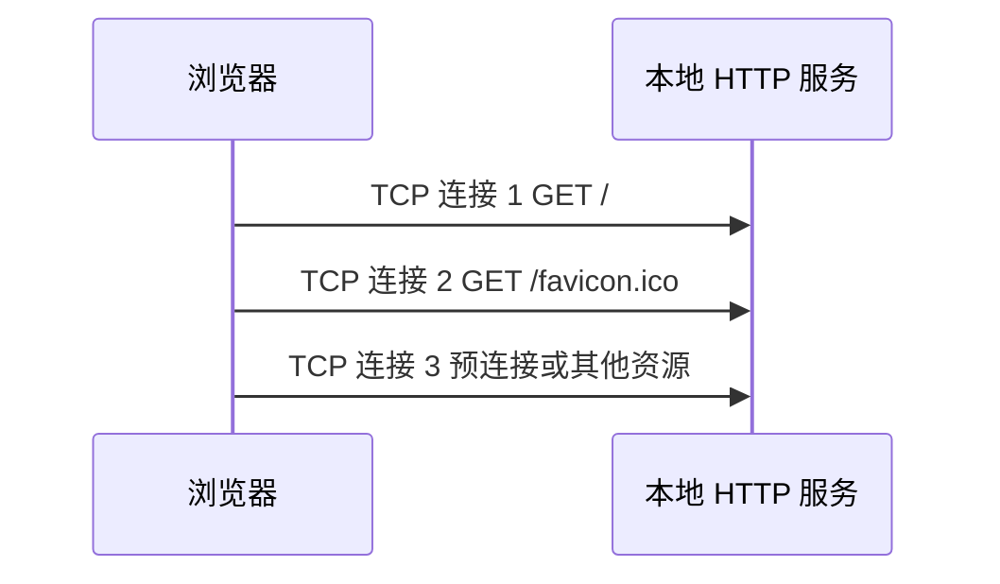

今天我在进行C++网络编程时遇到了一些奇怪的现象：
<!-- more -->

```mermaid
sequenceDiagram
  participant B as 浏览器
  participant S as 本地 HTTP 服务
  B->>S: TCP 连接 1 GET /
  B->>S: TCP 连接 2 GET /favicon.ico
  B->>S: TCP 连接 3 预连接或其他资源
```

使用浏览器访问本地设定的端口时创建了三次连接...这是为什么？创建了三次又为什么是三次？
