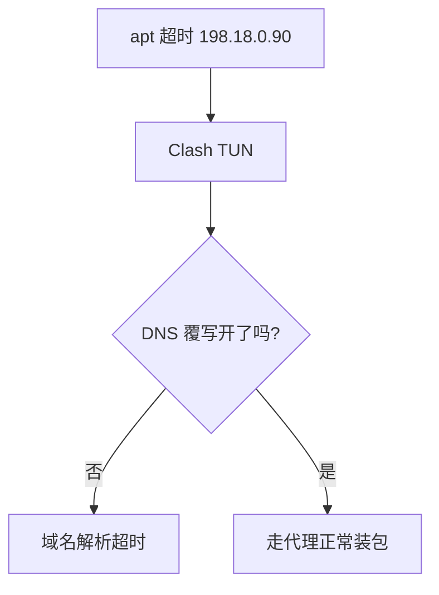

今天我想使用
```bash
sudo apt install -y libmysqlcppconn-dev
```
命令进行安装操作，等了一段时间回来一看发现报错了：
```
layyes@Aether:~/project/webserver/http_project$ sudo apt install -y libmysqlcppconn-dev
[sudo: authenticate] Password:         
Installing:                     
  libmysqlcppconn-dev

Installing dependencies:
  libmysqlcppconn7t64

Summary:
  Upgrading: 0, Installing: 2, Removing: 0, Not Upgrading: 27
  1 not fully installed or removed.
  Download size: 490 kB
  Space needed: 2742 kB / 1014 GB available

Ign:1 http://archive.ubuntu.com/ubuntu resolute/universe amd64 libmysqlcppconn7t64 amd64 1.1.12-4.1ubuntu4
Get:2 http://archive.ubuntu.com/ubuntu resolute/universe amd64 libmysqlcppconn-dev amd64 1.1.12-4.1ubuntu4 [279 kB]
Ign:2 http://archive.ubuntu.com/ubuntu resolute/universe amd64 libmysqlcppconn-dev amd64 1.1.12-4.1ubuntu4   
Ign:1 http://archive.ubuntu.com/ubuntu resolute/universe amd64 libmysqlcppconn7t64 amd64 1.1.12-4.1ubuntu4   
Ign:2 http://archive.ubuntu.com/ubuntu resolute/universe amd64 libmysqlcppconn-dev amd64 1.1.12-4.1ubuntu4
Ign:1 http://archive.ubuntu.com/ubuntu resolute/universe amd64 libmysqlcppconn7t64 amd64 1.1.12-4.1ubuntu4
Ign:2 http://archive.ubuntu.com/ubuntu resolute/universe amd64 libmysqlcppconn-dev amd64 1.1.12-4.1ubuntu4
Get:1 http://archive.ubuntu.com/ubuntu resolute/universe amd64 libmysqlcppconn7t64 amd64 1.1.12-4.1ubuntu4 [210 kB]
Err:1 http://archive.ubuntu.com/ubuntu resolute/universe amd64 libmysqlcppconn7t64 amd64 1.1.12-4.1ubuntu4   
  Connection failed [IP: 198.18.0.90 80]
  Connection timed out [IP: 198.18.0.90 80]
Err:2 http://archive.ubuntu.com/ubuntu resolute/universe amd64 libmysqlcppconn-dev amd64 1.1.12-4.1ubuntu4   
  Connection timed out [IP: 198.18.0.90 80]
  Connection failed [IP: 198.18.0.90 80]
Error: Failed to fetch http://archive.ubuntu.com/ubuntu/pool/universe/m/mysql-connector-c%2b%2b/libmysqlcppconn7t64_1.1.12-4.1ubuntu4_amd64.deb  Connection timed out [IP: 198.18.0.90 80]
Error: Failed to fetch http://archive.ubuntu.com/ubuntu/pool/universe/m/mysql-connector-c%2b%2b/libmysqlcppconn-dev_1.1.12-4.1ubuntu4_amd64.deb  Connection failed [IP: 198.18.0.90 80]
Error: Unable to fetch some archives, maybe run apt update or try with --fix-missing?
```

根据报错信息可以看得出来问题出在网络：连接 Ubuntu 源超时了
```
Connection timed out [IP: 198.18.0.90 80]
Connection failed [IP: 198.18.0.90 80]
```

包是对的，问题在网络/Ubuntu 源连接不稳定，这和本地挂的代理软件有关，现在有两种解决方法：
1.不让WSL走代理了：清理 `~/.bashrc` 或 `/etc/environment` 中关于 `http_proxy` 的配置，并检查 `/etc/apt/apt.conf.d/` 下的代理配置文件。
2.希望使用代理

因为某些原因还是选择2：



看来是忘记开DNS覆写了...
顺便记一下不开会怎样：**TUN 模式依赖 Clash 接管 DNS 解析，否则域名解析会超时**

```
ayyes@Aether:~/project/webserver/http_project$ sudo apt install -y libmysqlcppconn-dev
libmysqlcppconn-dev is already the newest version (1.1.12-4.1ubuntu4).
Summary:                    
  Upgrading: 0, Installing: 0, Removing: 0, Not Upgrading: 27
  1 not fully installed or removed.
  Space needed: 0 B / 1014 GB available

Setting up mysql-server (8.4.10-0ubuntu0.26.04.1) ...
dpkg: error processing package mysql-server (--configure):
 old mysql-server package postinst maintainer script subprocess failed with exit status 1
Errors were encountered while processing:
 mysql-server
Error: Sub-process /usr/bin/dpkg returned an error code (1)
```

解决是解决了，但是又报新的错误了，看来是之前网络中断导致的安装脚本损坏了

清理一下失败的安装包：
```bash
sudo mv /var/lib/dpkg/info/mysql-server.postinst /var/lib/dpkg/info/mysql-server.postinst.bak
```

重新配置：
```bash
sudo dpkg --configure -a
```

验证：
```bash
sudo apt install -f
```

```
layyes@Aether:~/project/webserver/http_project$ sudo apt install -f
Summary:                        
  Upgrading: 0, Installing: 0, Removing: 0, Not Upgrading: 27
```


```
layyes@Aether:~/project/webserver/http_project$ sudo apt install -y libmysqlcppconn-dev
libmysqlcppconn-dev is already the newest version (1.1.12-4.1ubuntu4).
Summary:                    
  Upgrading: 0, Installing: 0, Removing: 0, Not Upgrading: 27
```
搞定！

# 总结

代理工具没开DNS覆写导致域名解析错误。