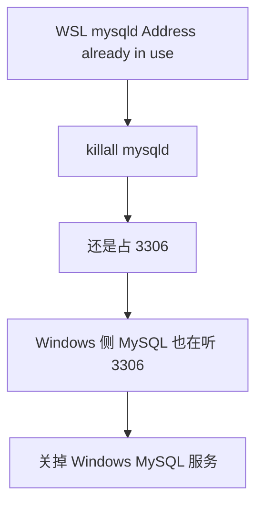

今天在跑一个项目时遇到了以下的问题：
```
layyes@Aether:~/project/webserver/http_project$ sudo systemctl start mysql
Job for mysql.service failed because the control process exited with error code.
See "systemctl status mysql.service" and "journalctl -xeu mysql.service" for details.
```

这说明MySQL 服务在启动过程中遇到了配置或文件权限问题
查看日志：
```bash
sudo journalctl -xeu mysql.service --no-pager -n 30
```

```
layyes@Aether:~/project/webserver/http_project$ sudo journalctl -xeu mysql.service --no-pager -n 30
Aug 26 21:48:58 Aether systemd[1]: mysql.service: Main process exited, code=exited, status=1/FAILURE
░░ Subject: Unit process exited
░░ Defined-By: systemd
░░ Support: http://www.ubuntu.com/support
░░ 
░░ An ExecStart= process belonging to unit mysql.service has exited.
░░ 
░░ The process' exit code is 'exited' and its exit status is 1.
Aug 26 21:48:58 Aether systemd[1]: mysql.service: Failed with result 'exit-code'.
░░ Subject: Unit failed
░░ Defined-By: systemd
░░ Support: http://www.ubuntu.com/support
░░ 
░░ The unit mysql.service has entered the 'failed' state with result 'exit-code'.
Aug 26 21:48:58 Aether systemd[1]: Failed to start mysql.service - MySQL Community Server.
░░ Subject: A start job for unit mysql.service has failed
░░ Defined-By: systemd
░░ Support: http://www.ubuntu.com/support
░░ 
░░ A start job for unit mysql.service has finished with a failure.
░░ 
░░ The job identifier is 485366 and the job result is failed.
Aug 26 21:48:58 Aether systemd[1]: mysql.service: Consumed 1.831s CPU time over 4.871s wall clock time, 485.4M memory peak.
░░ Subject: Resources consumed by unit runtime
░░ Defined-By: systemd
░░ Support: http://www.ubuntu.com/support
░░ 
░░ The unit mysql.service completed and consumed the indicated resources.
Aug 26 21:48:59 Aether systemd[1]: mysql.service: Scheduled restart job, restart counter is at 18.
░░ Subject: Automatic restarting of a unit has been scheduled
░░ Defined-By: systemd
░░ Support: http://www.ubuntu.com/support
░░ 
░░ Automatic restarting of the unit mysql.service has been scheduled, as the result for
░░ the configured Restart= setting for the unit.
Aug 26 21:48:59 Aether systemd[1]: Starting mysql.service - MySQL Community Server...
░░ Subject: A start job for unit mysql.service has begun execution
░░ Defined-By: systemd
░░ Support: http://www.ubuntu.com/support
░░ 
░░ A start job for unit mysql.service has begun execution.
░░ 
░░ The job identifier is 485443.
Aug 26 21:49:03 Aether systemd[1]: mysql.service: Main process exited, code=exited, status=1/FAILURE
░░ Subject: Unit process exited
░░ Defined-By: systemd
░░ Support: http://www.ubuntu.com/support
░░ 
░░ An ExecStart= process belonging to unit mysql.service has exited.
░░ 
░░ The process' exit code is 'exited' and its exit status is 1.
Aug 26 21:49:03 Aether systemd[1]: mysql.service: Failed with result 'exit-code'.
░░ Subject: Unit failed
░░ Defined-By: systemd
░░ Support: http://www.ubuntu.com/support
░░ 
░░ The unit mysql.service has entered the 'failed' state with result 'exit-code'.
Aug 26 21:49:03 Aether systemd[1]: Failed to start mysql.service - MySQL Community Server.
░░ Subject: A start job for unit mysql.service has failed
░░ Defined-By: systemd
░░ Support: http://www.ubuntu.com/support
░░ 
░░ A start job for unit mysql.service has finished with a failure.
░░ 
░░ The job identifier is 485443 and the job result is failed.
Aug 26 21:49:03 Aether systemd[1]: mysql.service: Consumed 1.712s CPU time over 4.873s wall clock time, 485.2M memory peak.
░░ Subject: Resources consumed by unit runtime
░░ Defined-By: systemd
░░ Support: http://www.ubuntu.com/support
░░ 
░░ The unit mysql.service completed and consumed the indicated resources.
Aug 26 21:49:03 Aether systemd[1]: mysql.service: Scheduled restart job, restart counter is at 19.
░░ Subject: Automatic restarting of a unit has been scheduled
░░ Defined-By: systemd
░░ Support: http://www.ubuntu.com/support
░░ 
░░ Automatic restarting of the unit mysql.service has been scheduled, as the result for
░░ the configured Restart= setting for the unit.
Aug 26 21:49:03 Aether systemd[1]: Starting mysql.service - MySQL Community Server...
░░ Subject: A start job for unit mysql.service has begun execution
░░ Defined-By: systemd
░░ Support: http://www.ubuntu.com/support
░░ 
░░ A start job for unit mysql.service has begun execution.
░░ 
░░ The job identifier is 485520.
Aug 26 21:49:08 Aether systemd[1]: mysql.service: Main process exited, code=exited, status=1/FAILURE
░░ Subject: Unit process exited
░░ Defined-By: systemd
░░ Support: http://www.ubuntu.com/support
░░ 
░░ An ExecStart= process belonging to unit mysql.service has exited.
░░ 
░░ The process' exit code is 'exited' and its exit status is 1.
Aug 26 21:49:08 Aether systemd[1]: mysql.service: Failed with result 'exit-code'.
░░ Subject: Unit failed
░░ Defined-By: systemd
░░ Support: http://www.ubuntu.com/support
░░ 
░░ The unit mysql.service has entered the 'failed' state with result 'exit-code'.
Aug 26 21:49:08 Aether systemd[1]: Failed to start mysql.service - MySQL Community Server.
░░ Subject: A start job for unit mysql.service has failed
░░ Defined-By: systemd
░░ Support: http://www.ubuntu.com/support
░░ 
░░ A start job for unit mysql.service has finished with a failure.
░░ 
░░ The job identifier is 485520 and the job result is failed.
Aug 26 21:49:08 Aether systemd[1]: mysql.service: Consumed 1.729s CPU time over 4.849s wall clock time, 484.5M memory peak.
░░ Subject: Resources consumed by unit runtime
░░ Defined-By: systemd
░░ Support: http://www.ubuntu.com/support
░░ 
░░ The unit mysql.service completed and consumed the indicated resources.
Aug 26 21:49:08 Aether systemd[1]: mysql.service: Scheduled restart job, restart counter is at 20.
░░ Subject: Automatic restarting of a unit has been scheduled
░░ Defined-By: systemd
░░ Support: http://www.ubuntu.com/support
░░ 
░░ Automatic restarting of the unit mysql.service has been scheduled, as the result for
░░ the configured Restart= setting for the unit.
Aug 26 21:49:08 Aether systemd[1]: Starting mysql.service - MySQL Community Server...
░░ Subject: A start job for unit mysql.service has begun execution
░░ Defined-By: systemd
░░ Support: http://www.ubuntu.com/support
░░ 
░░ A start job for unit mysql.service has begun execution.
░░ 
░░ The job identifier is 485597.
Aug 26 21:49:13 Aether systemd[1]: mysql.service: Main process exited, code=exited, status=1/FAILURE
░░ Subject: Unit process exited
░░ Defined-By: systemd
░░ Support: http://www.ubuntu.com/support
░░ 
░░ An ExecStart= process belonging to unit mysql.service has exited.
░░ 
░░ The process' exit code is 'exited' and its exit status is 1.
Aug 26 21:49:13 Aether systemd[1]: mysql.service: Failed with result 'exit-code'.
░░ Subject: Unit failed
░░ Defined-By: systemd
░░ Support: http://www.ubuntu.com/support
░░ 
░░ The unit mysql.service has entered the 'failed' state with result 'exit-code'.
Aug 26 21:49:13 Aether systemd[1]: Failed to start mysql.service - MySQL Community Server.
░░ Subject: A start job for unit mysql.service has failed
░░ Defined-By: systemd
░░ Support: http://www.ubuntu.com/support
░░ 
░░ A start job for unit mysql.service has finished with a failure.
░░ 
░░ The job identifier is 485597 and the job result is failed.
Aug 26 21:49:13 Aether systemd[1]: mysql.service: Consumed 1.779s CPU time over 4.988s wall clock time, 486.8M memory peak.
░░ Subject: Resources consumed by unit runtime
░░ Defined-By: systemd
░░ Support: http://www.ubuntu.com/support
░░ 
░░ The unit mysql.service completed and consumed the indicated resources.
Aug 26 21:49:13 Aether systemd[1]: mysql.service: Scheduled restart job, restart counter is at 21.
░░ Subject: Automatic restarting of a unit has been scheduled
░░ Defined-By: systemd
░░ Support: http://www.ubuntu.com/support
░░ 
░░ Automatic restarting of the unit mysql.service has been scheduled, as the result for
░░ the configured Restart= setting for the unit.
Aug 26 21:49:13 Aether systemd[1]: Starting mysql.service - MySQL Community Server...
░░ Subject: A start job for unit mysql.service has begun execution
░░ Defined-By: systemd
░░ Support: http://www.ubuntu.com/support
░░ 
░░ A start job for unit mysql.service has begun execution.
░░ 
░░ The job identifier is 485674.
Aug 26 21:49:18 Aether systemd[1]: mysql.service: Main process exited, code=exited, status=1/FAILURE
░░ Subject: Unit process exited
░░ Defined-By: systemd
░░ Support: http://www.ubuntu.com/support
░░ 
░░ An ExecStart= process belonging to unit mysql.service has exited.
░░ 
░░ The process' exit code is 'exited' and its exit status is 1.
Aug 26 21:49:18 Aether systemd[1]: mysql.service: Failed with result 'exit-code'.
░░ Subject: Unit failed
░░ Defined-By: systemd
░░ Support: http://www.ubuntu.com/support
░░ 
░░ The unit mysql.service has entered the 'failed' state with result 'exit-code'.
Aug 26 21:49:18 Aether systemd[1]: Failed to start mysql.service - MySQL Community Server.
░░ Subject: A start job for unit mysql.service has failed
░░ Defined-By: systemd
░░ Support: http://www.ubuntu.com/support
░░ 
░░ A start job for unit mysql.service has finished with a failure.
░░ 
░░ The job identifier is 485674 and the job result is failed.
Aug 26 21:49:18 Aether systemd[1]: mysql.service: Consumed 1.793s CPU time over 5.068s wall clock time, 484.5M memory peak.
░░ Subject: Resources consumed by unit runtime
░░ Defined-By: systemd
░░ Support: http://www.ubuntu.com/support
░░ 
░░ The unit mysql.service completed and consumed the indicated resources.
Aug 26 21:49:18 Aether systemd[1]: mysql.service: Scheduled restart job, restart counter is at 22.
░░ Subject: Automatic restarting of a unit has been scheduled
░░ Defined-By: systemd
░░ Support: http://www.ubuntu.com/support
░░ 
░░ Automatic restarting of the unit mysql.service has been scheduled, as the result for
░░ the configured Restart= setting for the unit.
Aug 26 21:49:18 Aether systemd[1]: Starting mysql.service - MySQL Community Server...
░░ Subject: A start job for unit mysql.service has begun execution
░░ Defined-By: systemd
░░ Support: http://www.ubuntu.com/support
░░ 
░░ A start job for unit mysql.service has begun execution.
░░ 
░░ The job identifier is 485751.
```

`journalctl` 只输出了 systemd 频繁重启服务失败的外层记录（`status=1/FAILURE`），具体的崩溃原因记录在 MySQL 自己的错误日志中，直接查看 MySQL 日志文件的最后 30 行：
```bash
sudo tail -n 30 /var/log/mysql/error.log
```

```
2026-08-26T13:50:22.096024Z 0 [System] [MY-015016] [Server] MySQL Server - end.
2026-08-26T13:50:22.413111Z 0 [System] [MY-015015] [Server] MySQL Server - start.
2026-08-26T13:50:22.656259Z 0 [System] [MY-010116] [Server] /usr/sbin/mysqld (mysqld 8.4.10-0ubuntu0.26.04.1) starting as process 367875
2026-08-26T13:50:22.662681Z 1 [System] [MY-013576] [InnoDB] InnoDB initialization has started.
2026-08-26T13:50:23.710201Z 1 [System] [MY-013577] [InnoDB] InnoDB initialization has ended.
2026-08-26T13:50:24.974241Z 0 [ERROR] [MY-011300] [Server] Plugin mysqlx reported: 'Setup of bind-address: '127.0.0.1' port: 33060 failed, `bind()` failed with error: Address already in use (98). Do you already have another mysqld server running with Mysqlx ?'
2026-08-26T13:50:24.974316Z 0 [ERROR] [MY-013597] [Server] Plugin mysqlx reported: 'Value '127.0.0.1' set to `Mysqlx_bind_address`, X Plugin can't bind to it. Skipping this value.'
2026-08-26T13:50:25.395195Z 0 [Warning] [MY-010068] [Server] CA certificate ca.pem is self signed.
2026-08-26T13:50:25.395264Z 0 [System] [MY-013602] [Server] Channel mysql_main configured to support TLS. Encrypted connections are now supported for this channel.
2026-08-26T13:50:25.403162Z 0 [ERROR] [MY-010262] [Server] Can't start server: Bind on TCP/IP port: Address already in use
2026-08-26T13:50:25.403215Z 0 [ERROR] [MY-010257] [Server] Do you already have another mysqld server running on port: 3306 ?
2026-08-26T13:50:25.403320Z 0 [ERROR] [MY-010119] [Server] Aborting
2026-08-26T13:50:26.825834Z 0 [System] [MY-010910] [Server] /usr/sbin/mysqld: Shutdown complete (mysqld 8.4.10-0ubuntu0.26.04.1)  (Ubuntu).
2026-08-26T13:50:26.825877Z 0 [System] [MY-015016] [Server] MySQL Server - end.
2026-08-26T13:50:27.195417Z 0 [System] [MY-015015] [Server] MySQL Server - start.
2026-08-26T13:50:27.472406Z 0 [System] [MY-010116] [Server] /usr/sbin/mysqld (mysqld 8.4.10-0ubuntu0.26.04.1) starting as process 367926
2026-08-26T13:50:27.487494Z 1 [System] [MY-013576] [InnoDB] InnoDB initialization has started.
2026-08-26T13:50:28.481288Z 1 [System] [MY-013577] [InnoDB] InnoDB initialization has ended.
2026-08-26T13:50:29.714250Z 0 [ERROR] [MY-011300] [Server] Plugin mysqlx reported: 'Setup of bind-address: '127.0.0.1' port: 33060 failed, `bind()` failed with error: Address already in use (98). Do you already have another mysqld server running with Mysqlx ?'
2026-08-26T13:50:29.714325Z 0 [ERROR] [MY-013597] [Server] Plugin mysqlx reported: 'Value '127.0.0.1' set to `Mysqlx_bind_address`, X Plugin can't bind to it. Skipping this value.'
2026-08-26T13:50:30.111986Z 0 [Warning] [MY-010068] [Server] CA certificate ca.pem is self signed.
2026-08-26T13:50:30.112065Z 0 [System] [MY-013602] [Server] Channel mysql_main configured to support TLS. Encrypted connections are now supported for this channel.
2026-08-26T13:50:30.117178Z 0 [ERROR] [MY-010262] [Server] Can't start server: Bind on TCP/IP port: Address already in use
2026-08-26T13:50:30.117220Z 0 [ERROR] [MY-010257] [Server] Do you already have another mysqld server running on port: 3306 ?
2026-08-26T13:50:30.117303Z 0 [ERROR] [MY-010119] [Server] Aborting
2026-08-26T13:50:31.572559Z 0 [System] [MY-010910] [Server] /usr/sbin/mysqld: Shutdown complete (mysqld 8.4.10-0ubuntu0.26.04.1)  (Ubuntu).
2026-08-26T13:50:31.572603Z 0 [System] [MY-015016] [Server] MySQL Server - end.
2026-08-26T13:50:31.961736Z 0 [System] [MY-015015] [Server] MySQL Server - start.
2026-08-26T13:50:32.268929Z 0 [System] [MY-010116] [Server] /usr/sbin/mysqld (mysqld 8.4.10-0ubuntu0.26.04.1) starting as process 367976
2026-08-26T13:50:32.279747Z 1 [System] [MY-013576] [InnoDB] InnoDB initialization has started.
```

可以看出问题的核心Address already in use：
```
[ERROR] [MY-010262] Can't start server: Bind on TCP/IP port: Address already in use
[ERROR] [MY-010257] Do you already have another mysqld server running on port: 3306 ?
```
简单来说就是系统中已经有一个僵尸 `mysqld` 进程占用了 **3306** 和 **33060** 端口，导致 systemd 新拉起的 MySQL 实例无法绑定端口，不断崩溃并循环重启。使用kill杀死进程
```bash
sudo killall -9 mysqld
```

但是重新启动mysql后还是报一样的错误，这时候我意识到自己可能是把window侧的mysql服务开启，这时候**Windows 主机已经运行了一个 MySQL 实例（或者占用着 3306 端口）**。由于 WSL2 默认和 Windows 共享端口映射，Windows 侧占用的 3306 会导致 Linux 侧的 MySQL 无法绑定该端口，并在启动瞬间直接崩溃退出。



问题解决。