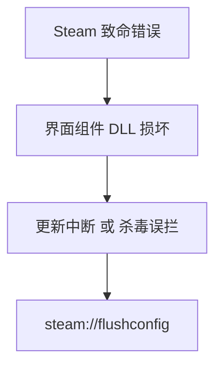

打开steam时遇到了以下问题：

<!-- more -->

可以看出是dll库出现了问题，通过搜索：通常是由于 Steam 的界面组件损坏、更新中断或被杀毒软件误拦截导致的（事实上安装的卡巴斯基真的给我弹过这个文件的警告，说是病毒文件，byd气笑了）。

先说一下解决办法：

- 按下 `Win + R` 键打开“运行”窗口。
    
- 在框中输入 `steam://flushconfig` 并按回车。

这里用的比较方便的方法，其他方法显而易见。

回头就删了它。