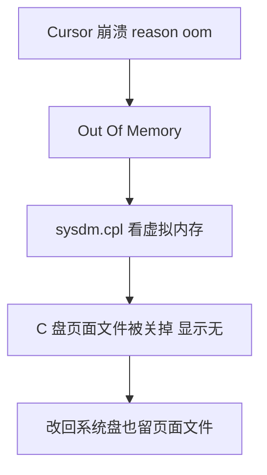

## 问题及解决

最近发现电脑是越来越卡了。。
一开始以为中病毒了，下载了一个卡巴斯基进行检查结果发现一切正常，一直到我用了Cursor，有一天报错了：

<!-- more -->

这个报错的意思是：错误提示中的 **`reason: 'oom'`** 代表 **Out Of Memory（内存溢出）**。这意味着 Cursor 进程在运行过程中耗尽了可用内存（物理内存或虚拟内存），通常与系统虚拟内存设置不足、项目文件过多导致后台索引爆内存，或者某些扩展占用过高有关

然后我想起来自己好像改过虚拟内存，用`sysdm.cpl`打开一看：原来是我当初改虚拟内存改错了，**我把 C 盘（系统固态硬盘 Windows-SSD）的虚拟内存关掉了（显示为“无”），转移到了 D 盘**。真相大白！

改正即可。

-----------------------------------

顺便写一下如何判断设置多少虚拟内存合适。

通过 Windows 自带的**任务管理器**来观察真实使用量：

1. 按 `Ctrl + Shift + Esc` 打开任务管理器，切换到 **“性能” -> “内存”** 选项卡。
    
2. 观察右下角的 **“已提交”（Committed）** 参数，它格式类似于 `12.5 / 31.9 GB`：
    
    - **斜线左边（12.5 GB）**：代表当前系统和所有软件（包括 Cursor、浏览器、后台服务等）实际向系统申请的内存总量。
        
    - **斜线右边（31.9 GB）**：代表你当前电脑的“物理内存 + 虚拟内存”总极限。
        
3. **判断方法**：在日常把常用的软件全打开、并让 Cursor 跑最复杂的任务时，看斜线左边的数值**最高能飙到多少**：
    
    - **最高所需虚拟内存 = 峰值已提交内存 - 物理内存(16 GB)**。
        
    - _示例_：我的峰值已提交内存达到了 `26 GB`，那么我至少需要 `26 - 16 = 10 GB` 的虚拟内存，才不会触发 `oom` 崩溃。

再记录一个把虚拟内存性能拉到最高的操作技巧：

目前 C 盘还有 83 GB 剩余空间，非常充裕。想要消除虚拟内存带来的磁盘读写开销，最有效的技巧是**设置“静态固定大小”**：

**1.将初始大小与最大值设为相同**：避免磁盘频繁扩容带来的性能损耗。

当“初始大小”和“最大值”不一致时，Windows 会根据需求动态给虚拟内存文件扩容/缩容，这会导致 SSD 产生文件碎片并占用微量 CPU。

直接将初始大小(I)和最大值(X)都填入相同的数值（例如都填 **16384**，即固定 16 GB；或者都填 **24576**，即固定 24 GB）。

修改后点击右侧的 **“设置(S)”**，再点击底部 **“确定”**，然后重启电脑。

**验证方法：** 重启后打开 C 盘根目录（需勾选显示隐藏文件），会看到一个固定大小为 16 GB/24 GB 的 `pagefile.sys` 文件，后续系统不再为其频繁分配磁盘空间。

**2.预留足够的 C 盘剩余空间：**保证 SSD 传输速度。

固态硬盘（SSD）在剩余空间过低时读写速度会大幅下降。建议在分配完虚拟内存后，确保 C 盘至少保留 **20 GB 以上** 的空闲空间，以保证 SSD 维持在最高读写效率。