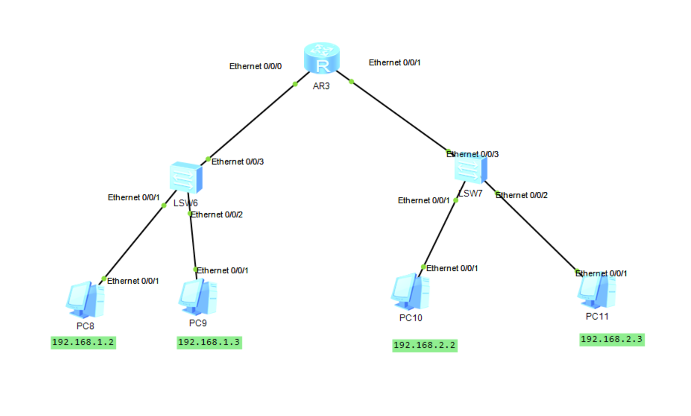
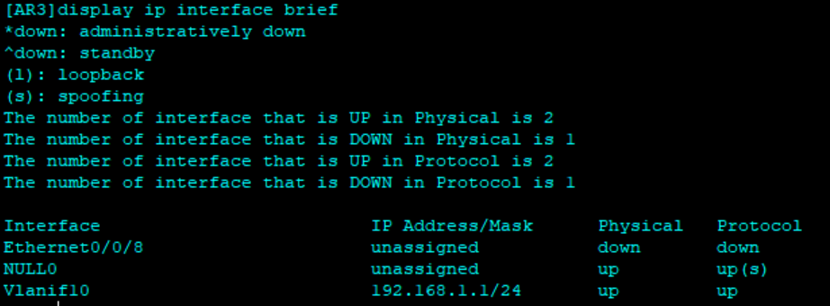

# 🌐 华为网络实战：从子网逻辑到跨 VLAN 路由（eNSP 篇）

## 一、子网划分的"潜规则"

在设计网络时，掩码决定了广播域的大小。

> **复习点**：只要 IP 落在子网掩码划分的"线"两侧，逻辑上就是隔离的。

**实战建议**：生产环境尽量避免使用 `/32`（主机路由）或 `/30`（极窄子网），推荐从 `/29` 或 `/28` 起步，为网关和未来扩展留出空间。

---

## 二、重点攻克：VLAN 与 Vlanif 的缠斗

初学者最常问：划分 VLAN 就是划分子网吗？

**结论：不是。**

| 概念 | 作用层 | 类比 |
|------|--------|------|
| VLAN | 二层（数据链路层） | 隔离广播域，是"墙" |
| Vlanif | 三层（网络层） | 实现跨网段路由，是"门" |

一个 VLAN 只有配上对应的 Vlanif，才能实现跨网段通信。

### 实验拓扑



图中左侧是接入层交换机1（LSW1），右侧是接入层交换机2（LSW2），上面是核心层路由器（AR）。其中LSW 负责划分 VLAN，AR 负责配置 Vlanif 实现跨 VLAN 路由。只有两者配合，PC8 才能成功 ping 通 PC9 / PC10 / PC11。

---

## 三、设备配置

### 3.1 二层交换机（LSW）

二层交换机不负责路由，只需确保包能带着正确的"标签"传给网关。

```bash
# 1. 创建 VLAN
[LSW] vlan batch 10 20

# 2. 接入口划分（连接 PC 的端口）
[LSW] interface Ethernet 0/0/1
[LSW-Ethernet0/0/1] port link-type access
[LSW-Ethernet0/0/1] port default vlan 10
[LSW-Ethernet0/0/1] quit

# 3. 上联口配置（发往网关的端口）
[LSW] interface Ethernet 0/0/3
[LSW-Ethernet0/0/3] port link-type access
[LSW-Ethernet0/0/3] port default vlan 10
[LSW-Ethernet0/0/3] quit
```


### 3.2 三层路由器（AR）

当物理接口无法直接配 IP（如 AR201 的 LAN 口）时，必须使用 Vlanif 绕路。

```bash
# 1. 先创建对应的 VLAN 实体
[AR3] vlan 10
[AR3-vlan10]quit

# 2. 进入逻辑接口，配置网关 IP
[AR3] interface Vlanif 10
[AR3-Vlanif10] ip address 192.168.1.1 24
[AR3-Vlanif10]quit

# 3. 关联物理接口（让包能进门）
[AR3] interface Ethernet 0/0/0
[AR3-Ethernet0/0/0] port link-type access
[AR3-Ethernet0/0/0] port default vlan 10
[AR3-Ethernet0/0/0]quit
```


---

## 四、Access 与 Trunk —— 交换机的"交通规则"

在多 VLAN 环境下，交换机接口必须明确自己的"身份"，配置错误数据包就会进死胡同。

### 核心定义

| 特性 | Access 端口 | Trunk 端口 |
|------|-------------|------------|
| 连接对象 | 电脑、打印机等终端 | 交换机、路由器、防火墙 |
| VLAN 数量 | 仅限 1 个 | 多个（手动指定列表） |
| 发往对端时 | 撕掉 VLAN 标签（解封装） | 保留 VLAN 标签（802.1Q） |
| 默认归属 | 默认属于 VLAN 1 | 默认允许 VLAN 1 通过 |

### 配置命令

**Access 端口（连 PC）：**

```bash
[LSW] interface Ethernet 0/0/1
[LSW-Ethernet0/0/1] port link-type access     # 定性：接入模式
[LSW-Ethernet0/0/1] port default vlan 10      # 定量：只属于 VLAN 10
```

**Trunk 端口（连交换机 / 路由器）：**

```bash
[LSW] interface GigabitEthernet 0/0/1
[LSW-GigabitEthernet0/0/1] port link-type trunk               # 定性：干道模式
[LSW-GigabitEthernet0/0/1] port trunk allow-pass vlan 10 20   # 授权：放行 VLAN 10 和 20
```

> **提示**：若需放行所有 VLAN 可用 `vlan all`，但生产环境建议按需授权。

### 【重点】数据包的"贴标与撕标"过程

追踪一个包从 PC 发出到抵达目标 PC 的完整旅程：

```
PC 发出原始包
    │
    ▼
进入 Access 口 ──► 交换机打上 VLAN 10 标签
    │
    ▼
进入 Trunk 口 ──► 带标签传向下一台交换机
    │
    ▼
对端 Trunk 口识别标签并允许进入
    │
    ▼
到达目标 Access 口 ──► 撕掉 VLAN 标签
    │
    ▼
原始包进入目标 PC
```

### 补充：Hybrid 模式

在华为设备上执行 `display this` 时，可能会看到接口默认是 `hybrid`。

Hybrid 是华为特有的"混合模式"，既能像 Access 一样接 PC，也能像 Trunk 一样接交换机，非常灵活，但配置复杂度更高，初学阶段建议先掌握 Access / Trunk。

---

## 五、避坑指南

### `ip address` 报错

- **现象**：在接口视图输入 `ip ?` 报错，或提示命令未识别
- **原因**：该接口处于二层交换模式
- **解决**：输入 `undo portswitch` 强制切换为三层路由模式；若硬件不支持（如 AR201 右侧口），改用 Vlanif 方案

### 终端网关配错

- **现象**：PC8 无法通信，PC9 / PC10 / PC11 正常
- **原因**：网关地址填错
- **原理**：PC 发现目标地址跨网段时，会寻找网关 MAC，网关填错则包无法出网卡

### Trunk 两端不对称

- **现象**：VLAN 流量单向不通或完全不通
- **原因**：Trunk 链路两端的 `allow-pass vlan` 列表不一致
- **解决**：两端配置必须对称，左边放行的 VLAN，右边也要放行

---

## 六、排错三步走

```
Step 1: ping 127.0.0.1     → 自检，确认 PC 网卡正常
Step 2: ping 网关 IP        → 检查二层/三层边界是否打通
Step 3: ping 目标 IP        → 验证全路径路由是否正常
```

---

## 七、给未来自己的寄语

网络工程师不只是在敲命令，更是在设计流量的"水利工程"：

- **VLAN** 是水库的隔板
- **Vlanif** 是连接不同隔板的水泵
- **掩码** 是划分水域的刻度

> 如果你在 AR201 上死活配不上 IP，记得看一眼接口名称。`Ethernet` 通常很顽固，而 `GigabitEthernet` 通常很温柔。实在不行，**Vlanif 是你永远的后盾**！
华为设备上输入 display this 时，可能会看到有些口默认是 hybrid。

Hybrid：这是华为特有的“混合模式”，它既能像 Access 一样接 PC，也能像 Trunk 一样接交换机，非常灵活。