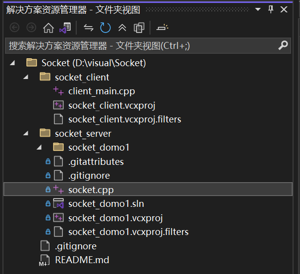
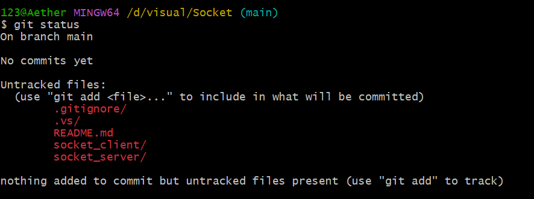
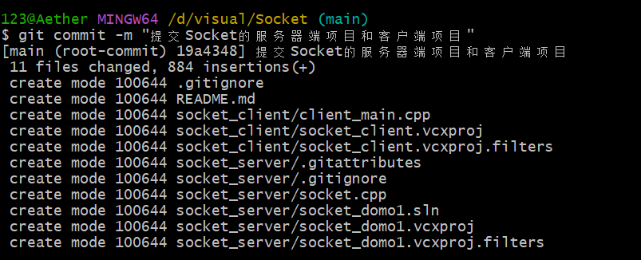
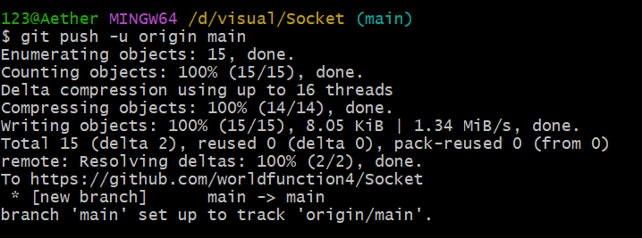
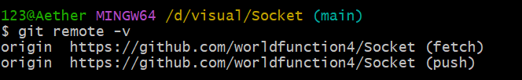

# 上传到自己的远程仓库踩坑总结

最近在使用 Visual Studio 开发一个 Socket 客户端与服务器端项目，遇到了一个问题：无法将本地代码推送到自己的远程仓库。经过一番调查和尝试，我发现可能是因为我没有正确设置远程仓库的 URL，当然也可能是因为我没有正确配置 Git 的用户信息，搞到后面甚至把我自己都搞晕了。。刚刚使用远程仓库的大概都会像我这样踩这么一个坑，这些都是一些由于操作习惯引起的典型问题。所以我决定写一篇文章来总结一下这个过程。

---

## 如何上传到自己的远程仓库（以 GitHub 为例）

### 第一步：建立远程仓库

首先，需要在 GitHub 上创建一个新的仓库，记住这个仓库的 URL，需要用 URL 来绑定本地仓库。

需要注意的是，我是做的 Socket 简易通信项目，所以 Socket 项目里面会有两个子项目，一个是客户端，一个是服务器端，这两个项目正常来说都在同一个 Git 仓库里，但是之前我在 GitHub 上创建了两个仓库，分别对应客户端和服务器端，这样就导致了我在重新上传时出现了”套娃现象”。

**建议**：在创建远程仓库时，只创建一个仓库来存放整个项目的代码。如果自己没注意已经建了仓库，在 Visual Studio 中文件图标会带有**蓝色小锁**：



---

### 第二步：初始化本地仓库并绑定远程仓库 URL

解决了套娃的问题，就能正常上传了，上传的步骤如下（这里采用通用的上传方法，即使用 Git 命令行）：

#### 1. 初始化 Git 仓库
在开始其他操作之前，最好先进行一个查看命令：
```bash
git status
```

在本地项目根目录下打开命令行，输入以下命令来初始化 Git 仓库：

```bash
git init
```

#### 2. 检查状态

看看有哪些文件被修改或者新增了：

```bash
git status
```

这里我运行后得到了以下输出：



可以看见我不小心创建了 `.gitignore/`，这样的话里面的过滤规则（比如过滤 `.vs/` 和 `x64/`）就不会生效，这会导致你把几百 MB 的 Visual Studio 缓存文件也传到 GitHub 上。所以我需要删除这个文件夹，并且重新创建一个正确的 `.gitignore` 文件。

里面一般包含以下常见的过滤规则：

```gitignore
.vs/
out/
x64/
Debug/
Release/
*.user
*.aps
```

#### 3. 绑定远程仓库 URL

这一步是我之前忘记做的，所以才会出现 `fatal: 'origin' does not appear to be a git repository` 的错误提示：

```bash
git remote add origin [URL]
```

> 注：URL 就是在 GitHub 上创建的仓库地址

如果已经关联过了就可以进行下一步了。

---

### 第三步：添加文件并提交

一旦确认文件是正确上传的文件，就可以进行添加所有文件操作了：

```bash
git add .
```

#### 提交的重要性

提交这一步非常关键，它是我们的第一颗”后悔药”。在 `git push` 到远程服务器之前，所有的提交都只记录在本地，如果是使用 Claude 等 AI 修改重要内容之前 `git commit` 也是很重要的，发现它修改得不对使用 `git reset --hard`，就能瞬间回到修改前的状态。

#### 常见操作

**如果发现文件传错了？** 我们可以撤销（Reset）：

```bash
git reset --soft HEAD^
```

**如果提交信息写错了？** 我们可以修正（Amend）：

```bash
git commit --amend -m “新的提交信息”
```

**正常提交：**

```bash
git commit -m “提交Socket的服务器端项目和客户端项目”
```



#### 推送到远程仓库

```bash
git push -u origin main
```

> 注：根据你的仓库默认分支，可能是 `main` 或 `master`



#### 验证远程仓库绑定

可以使用以下命令来查看远程仓库的 URL 是否正确绑定：

```bash
git remote -v
```



---

## 核心问题总结与排查

在实际操作中，我主要遇到了以下的”坑”：

### 1. 忽略文件 (.gitignore) 识别异常

`.gitignore` 曾被系统误识别为文件夹 `.gitignore/`，导致失效，这个虽然是我的误操作，但也能说明是**文件**而**不是文件夹**，其次这个文件必须是根目录下的文本文件。

对于 VS 项目，一定要在其中过滤掉 `.vs/`、`x64/`、`Debug/` 等编译缓存，否则仓库会非常臃肿。

### 2. 远程仓库未关联

在执行 `git push` 时提示 `fatal: 'origin' does not appear to be a git repository`。本地初始化后，并没有告诉 Git 对应的 GitHub URL 是什么，需要通过 `git remote add origin [URL]` 进行绑定，其中 URL 是自己在 GitHub 的项目地址。

### 3. 提交信息不规范

提交信息应该简洁明了，描述清楚这次提交的内容和目的。如果提交信息写错了，可以通过 `git commit --amend` 来修改最后一次提交的信息。

---

## 合并分支

在开发过程中，可能会创建多个分支来进行不同的功能开发或者修复 bug。当需要将某个分支的修改合并到主分支（如 `main` 或 `master`）时，可以使用以下命令（首先要切换到目标分支）：

```bash
git merge [分支名]
```

### 解决合并冲突

如果在合并过程中出现冲突，Git 会提示你哪些文件存在冲突，需要手动解决这些冲突。解决完冲突后，需要使用 `git add` 来标记已解决的文件，然后再进行提交：

```bash
git add .
git commit -m "解决合并冲突"
```

### 推送合并结果

最后上传到远程仓库：

```bash
git push origin main
```

> 注：根据你的仓库默认分支，可能是 `main` 或 `master`

然后应该就能在远程仓库上看到自己的分支合并了。

如果要查看自己之前提交的命令：
```bash
git log --oneline
```
`--oneline` 参数是为了极简，一行

## 其他命令

关于前文说到的“后悔药”：
```bash
git diff
```
作用：在 add 之前，比对当前代码和上一次提交到底差了哪些具体内容（**红减绿增**）。
```bash
git reset --hard <Hash码>
```
作用：粉碎性时光机。强制把代码恢复到指定 Hash 码时的状态，并抹除这期间所有未 Commit 的修改。（极其危险，敲之前务必确认）。
```bash
git reflog
```
作用：后悔药的后悔药。记录你在 Git 里的每一次极端操作轨迹。就算你用 reset --hard 搞丢了之前的 Commit，也可以从这里找回它的 Hash 码，然后再次穿越回去(所以在进行重要操作一定要记得**git commit**)。
```bash
git blame <文件名>
```
作用：逐行扫描文件，查出每一行代码是谁在什么时间提交的。不过我觉得配合 VS Code 的 GitLens 插件使用效果可以达到满级。
## 职业规则
永远不写 git commit -m "111" 或 "改了点东西"。使用 **约定式提交（Conventional Commits）**：

- feat:  (Feature) —— 新增了功能。

例：feat: 增加对 YAML 配置文件的解析支持

- fix（bug）:  (Fix) —— 修复了 Bug。

例：fix(bug): 解决 Excel 读取时由于空行导致的 KeyError

- docs:  (Documentation) —— 修改了文档或注释。

例：docs: 补充 main.py 的使用说明

- refactor:  (Refactor) —— 代码重构（没加新功能，也没修bug，纯优化结构）。

- test: (Test) —— 测试用例修改。
例：test: 增加网络延迟情况下的单元测试

- chore: (Chore) —— 构建过程或辅助工具的变动。
例：chore: 更新 .gitignore 忽略列表

- merge: (Merge) —— 有关合并。
例:merge: 合并本地仓库和远程仓库历史

## 补充内容
最近在写NetGuard项目的时候发现自己本地项目上传后没在自己远程仓库中看见,remote了一下发现地址也是正确的，然后log发现远程有三个提交而本地只有一个...那么我本地的提交到哪去了？**工作区——缓存区——远程**，所以一直在缓存区，也就是本地仓库，

## 总结

这次上传到远程仓库的经历，也是让我学到了很多关于 Git 和版本控制的知识，虽然遇到问题也挺多，感觉如果理不清还是挺乱的。
最后发现了一个可以用来练习Git命令的交互式网站：https://learngitbranching.js.org/
官方文档：https://git-scm.com/doc